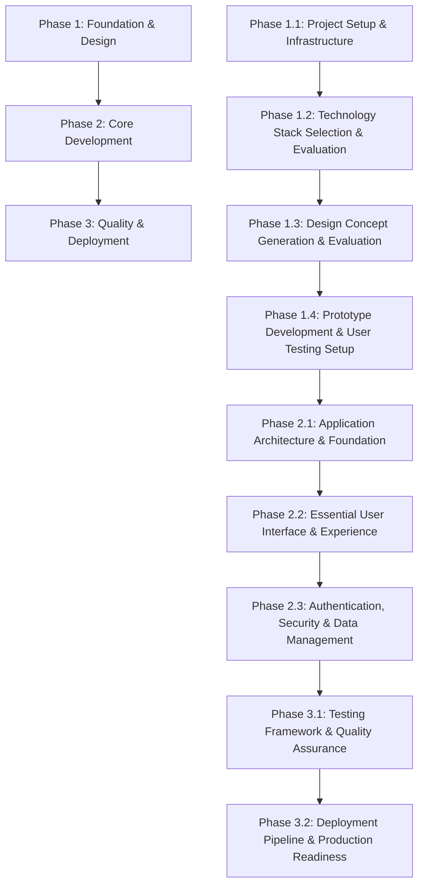

# [Project Name] Development Roadmap

**Project:** [Project Name] - [Brief Project Description]
**Version:** [Version Number]
**Created:** [Creation Date]
**Last Updated:** [Last Update Date]
**Project Lead:** [Project Lead/Team Name]
**Development Approach:** [Design-driven Development Methodology with AI Assistant Integration]

## Development Environment Requirements

**[Technology] Version Requirement**: This project requires [Technology] [Version]+ or compatible version.

**Technology Stack Verification**:
```bash
[command] --version  # Should show [version] or higher
[package-manager] --version   # Should show compatible version
```

This setup ensures compatibility with [Framework/Technology], [Language] strict mode, and modern development tools.

## Executive Summary

[Project Name] is a comprehensive [domain/purpose] application that transforms [problem statement] into [solution description]. The project emphasizes [key feature 1], [key feature 2], [key feature 3], and [key feature 4].

### Project Scope
- **Total Estimated Duration**: [X] weeks ([Y] months)
- **Number of Phases**: [X] phases with [Y] sub-phases
- **Primary Technology Stack**: [Technology Stack]
- **Target Performance**: [Performance Targets]
- **Accessibility Standard**: [Accessibility Standard]
- **Development Methodology**: [Design-driven methodology] with AI assistant integration

### Success Metrics
- **Performance Targets**: [Performance Metrics]
- **Quality Standards**: [Quality Metrics]
- **User Experience**: [UX Metrics]
- **Technical Debt**: [Technical Standards]

## Project Architecture Overview

### Technology Stack
```
Frontend:
├── Framework: [Frontend Framework]
├── Language: [Programming Language]
├── State Management: [State Management Solution]
├── Styling: CSS Modules + [Design System]
├── Testing: [Testing Framework]
└── Build Tool: [Build Tool]

Backend:
├── Runtime: [Runtime Environment]
├── Framework: [Backend Framework]
├── Database: [Database Solution]
├── ORM: [ORM/Database Layer]
├── Authentication: [Auth Solution]
└── API: [API Architecture]

Infrastructure:
├── Deployment: [Deployment Platform]
├── Database Hosting: [Database Hosting]
├── Monitoring: [Monitoring Tools]
└── CDN: [CDN Solution]
```

### Feature-Based Folder Structure
```
src/
├── features/
│   ├── [feature-1]/
│   │   ├── components/           # [Feature 1] components
│   │   ├── hooks/               # [Feature 1] hooks
│   │   ├── services/            # [Feature 1] services
│   │   ├── types/               # [Feature 1] TypeScript types
│   │   ├── utils/               # [Feature 1] utilities
│   │   ├── store/               # [Feature 1] state management
│   │   ├── tests/               # [Feature 1] tests
│   │   └── README.md            # [Feature 1] documentation
│   ├── [feature-2]/
│   ├── [feature-3]/
│   ├── [feature-4]/
│   └── shared/                  # Shared utilities and components
├── components/                  # Global UI components (design system)
├── lib/                         # Third-party integrations
├── styles/                      # Global styles and design tokens
└── docs/                        # Feature documentation
```

## Development Methodology

### Solo Development with AI Assistants

#### Pre-Development Planning Phase
**MANDATORY**: Before any development begins, teams MUST complete the Implementation Planning & Methodology Selection process:

1. **Implementation Planning Requirements**
   - Create 3 distinct implementation plans (one for each methodology)
   - Include effort estimates, risk assessments, and success probability ratings
   - Complete structured decision matrix for methodology selection
   - Validate team capacity, timeline constraints, and technical complexity alignment

2. **Decision Matrix Template**
   ```markdown
   | Criteria | Weight | Methodology A | Methodology B | Methodology C |
   |----------|--------|---------------|---------------|---------------|
   | Timeline Constraint | 25% | [Score 1-5] | [Score 1-5] | [Score 1-5] |
   | Team Expertise | 20% | [Score 1-5] | [Score 1-5] | [Score 1-5] |
   | Technical Complexity | 20% | [Score 1-5] | [Score 1-5] | [Score 1-5] |
   | Resource Availability | 15% | [Score 1-5] | [Score 1-5] | [Score 1-5] |
   | Risk Tolerance | 10% | [Score 1-5] | [Score 1-5] | [Score 1-5] |
   | Future Scalability | 10% | [Score 1-5] | [Score 1-5] | [Score 1-5] |
   | **Total Weighted Score** | 100% | [Calculated] | [Calculated] | [Calculated] |
   ```

#### Reference Documentation Requirements
**MANDATORY**: Every phase and sub-phase MUST include a Reference Documentation section with three alternative methodologies following this exact structure:

```markdown
#### Reference Documentation
[Phase/Feature name] with three alternative [implementation/approach] methodologies:
- **Foundation**: `docs/sandbox/[phase-number]-[phase-folder]/00-[phase-name]-foundation.md`
- **Methodology A**: `docs/sandbox/[phase-number]-[phase-folder]/01-[methodology-a-name].md` ([Brief description of approach A])
- **Methodology B**: `docs/sandbox/[phase-number]-[phase-folder]/02-[methodology-b-name].md` ([Brief description of approach B])
- **Methodology C**: `docs/sandbox/[phase-number]-[phase-folder]/03-[methodology-c-name].md` ([Brief description of approach C])

**Selection Criteria**: [Guidance for choosing between methodologies based on project constraints, team expertise, timeline, and business requirements]
```

#### Three-Methodology Approach Guidelines
Each Reference Documentation section must provide three distinct approaches with specific scope boundaries and implementation timelines:

1. **Methodology A (MVP/Rapid)**: 2-4 week implementation
   - **Scope**: Core features only, minimal customization
   - **Features**: Essential functionality, basic UI, standard patterns
   - **Complexity**: Low - proven solutions, minimal dependencies
   - **Risk Level**: Low - well-tested approaches, quick validation
   - **Team Requirements**: 1-2 developers, basic expertise level
   - **Success Criteria**: Functional MVP, basic user workflows, 80% core features

2. **Methodology B (Balanced/Standard)**: 4-8 week implementation
   - **Scope**: Essential features + 2-3 enhancements, moderate customization
   - **Features**: Core functionality + user experience improvements, responsive design
   - **Complexity**: Medium - modern patterns, selective optimization
   - **Risk Level**: Medium - balanced approach, manageable complexity
   - **Team Requirements**: 2-3 developers, intermediate expertise level
   - **Success Criteria**: Production-ready application, 90% planned features, performance targets met

3. **Methodology C (Comprehensive/Enterprise)**: 8-12 week implementation
   - **Scope**: Full feature set + advanced capabilities, extensive customization
   - **Features**: Complete functionality, advanced UI/UX, optimization, integrations
   - **Complexity**: High - cutting-edge patterns, comprehensive architecture
   - **Risk Level**: High - complex implementation, requires expertise
   - **Team Requirements**: 3-4 developers, advanced expertise level
   - **Success Criteria**: Enterprise-grade solution, 100% features, scalability validated

#### Individual Development Roadmaps
**MANDATORY**: Each methodology MUST include a detailed "Development Roadmap" sub-section with:

##### Methodology A (MVP/Rapid) - Development Roadmap Template
```markdown
**Week 1**: Foundation & Core Setup
- Days 1-2: Project setup, basic architecture
- Days 3-5: Core feature implementation (Feature X, Feature Y)
- **Deliverable**: Working prototype with core functionality
- **Risk Mitigation**: Daily progress checks, scope validation
- **Resource Allocation**: 1 senior developer (40 hrs)

**Week 2**: Integration & Basic UI
- Days 1-3: Feature integration, basic styling
- Days 4-5: Testing, bug fixes, deployment setup
- **Deliverable**: Functional MVP ready for user testing
- **Risk Mitigation**: Feature freeze, focus on stability
- **Resource Allocation**: 1 senior developer (40 hrs)

**Validation Checkpoints**: End of Week 1 (core features), End of Week 2 (MVP complete)
**Scope Adjustment Points**: Day 3 (feature scope), Day 8 (quality vs. timeline)
```

##### Methodology B (Balanced/Standard) - Development Roadmap Template
```markdown
**Week 1-2**: Foundation & Architecture
- Week 1: Project setup, architecture design, core infrastructure
- Week 2: Database design, API structure, authentication setup
- **Deliverable**: Solid foundation with basic CRUD operations
- **Risk Mitigation**: Architecture review, performance baseline
- **Resource Allocation**: 2 developers (80 hrs total)

**Week 3-4**: Core Feature Development
- Week 3: Primary features implementation (Feature A, Feature B)
- Week 4: Secondary features, integration testing
- **Deliverable**: Core functionality complete, basic UI
- **Risk Mitigation**: Feature prioritization, weekly demos
- **Resource Allocation**: 2 developers (80 hrs total)

**Week 5-6**: Enhancement & Polish
- Week 5: UI/UX improvements, responsive design
- Week 6: Performance optimization, advanced features
- **Deliverable**: Production-ready application
- **Risk Mitigation**: Feature freeze Week 5, focus on quality
- **Resource Allocation**: 2 developers + 1 designer (100 hrs total)

**Validation Checkpoints**: End of Week 2, 4, 6
**Scope Adjustment Points**: Week 2 (architecture), Week 4 (features), Week 5 (enhancements)
```

##### Methodology C (Comprehensive/Enterprise) - Development Roadmap Template
```markdown
**Phase 1 (Week 1-3): Foundation & Architecture**
- Week 1: Requirements analysis, architecture design
- Week 2: Infrastructure setup, development environment
- Week 3: Core framework, database architecture, security setup
- **Deliverable**: Robust foundation with scalable architecture
- **Risk Mitigation**: Architecture review, security audit
- **Resource Allocation**: 3 senior developers (120 hrs total)

**Phase 2 (Week 4-6): Core Development**
- Week 4: Primary feature development (Features A, B, C)
- Week 5: Secondary features, API development
- Week 6: Integration, middleware, business logic
- **Deliverable**: Complete core functionality
- **Risk Mitigation**: Weekly technical reviews, integration testing
- **Resource Allocation**: 3 developers + 1 architect (160 hrs total)

**Phase 3 (Week 7-9): Advanced Features & Integration**
- Week 7: Advanced features, third-party integrations
- Week 8: Performance optimization, caching, monitoring
- Week 9: Security hardening, compliance features
- **Deliverable**: Enterprise-ready features
- **Risk Mitigation**: Security review, performance testing
- **Resource Allocation**: 3 developers + 1 DevOps (160 hrs total)

**Phase 4 (Week 10-12): Quality & Deployment**
- Week 10: Comprehensive testing, bug fixes
- Week 11: Documentation, deployment automation
- Week 12: Final validation, production deployment
- **Deliverable**: Production-deployed enterprise solution
- **Risk Mitigation**: Staged deployment, rollback procedures
- **Resource Allocation**: Full team (180 hrs total)

**Validation Checkpoints**: End of each phase (Weeks 3, 6, 9, 12)
**Scope Adjustment Points**: Week 3 (architecture), Week 6 (features), Week 9 (advanced features)
```

#### Reference Documentation Validation Checklist
Before completing any phase, verify:

**Pre-Development Planning**
- [ ] Implementation Planning & Methodology Selection completed
- [ ] Decision matrix filled out with weighted scores for all criteria
- [ ] Team capacity validated against selected methodology requirements
- [ ] Risk assessment completed for chosen approach
- [ ] Success probability rating documented (minimum 70% for approval)

**Documentation Structure**
- [ ] Foundation document exists: `docs/sandbox/[phase-number]-[phase-folder]/00-[phase-name]-foundation.md`
- [ ] Methodology A document exists: `docs/sandbox/[phase-number]-[phase-folder]/01-[methodology-a-name].md`
- [ ] Methodology B document exists: `docs/sandbox/[phase-number]-[phase-folder]/02-[methodology-b-name].md`
- [ ] Methodology C document exists: `docs/sandbox/[phase-number]-[phase-folder]/03-[methodology-c-name].md`

**Methodology Requirements**
- [ ] Each methodology includes specific scope boundaries (features included/excluded)
- [ ] Timeline estimates align with methodology complexity (A: 2-4 weeks, B: 4-8 weeks, C: 8-12 weeks)
- [ ] Resource allocation requirements clearly defined for each methodology
- [ ] Development roadmap with week-by-week milestones included for each methodology
- [ ] Validation checkpoints and scope adjustment points identified
- [ ] Risk mitigation strategies documented for each phase

**Quality Standards**
- [ ] Selection criteria clearly explain trade-offs between methodologies
- [ ] Each methodology offers distinct approaches (complexity, timeline, features, risk)
- [ ] Success criteria defined and measurable for each methodology
- [ ] Documentation follows the standardized template structure
- [ ] All methodologies are validated and tested approaches
- [ ] Implementation examples or code snippets are provided where applicable
- [ ] Early warning indicators for scope creep documented

#### Success Metrics and Validation Templates

##### Progress Tracking Template
```markdown
## [Methodology X] Progress Tracking

### Week [X] Status Report
**Date**: [Date]
**Phase**: [Current Phase]
**Overall Progress**: [X]% complete

#### Completed Milestones
- [ ] [Milestone 1] - [Completion Date]
- [ ] [Milestone 2] - [Completion Date]
- [ ] [Milestone 3] - [Completion Date]

#### Current Week Objectives
- [ ] [Objective 1] - [Target Date]
- [ ] [Objective 2] - [Target Date]
- [ ] [Objective 3] - [Target Date]

#### Risks and Issues
| Risk/Issue | Impact | Probability | Mitigation | Status |
|------------|--------|-------------|------------|--------|
| [Risk 1] | [High/Med/Low] | [High/Med/Low] | [Action] | [Open/Resolved] |

#### Success Metrics
- **Feature Completion**: [X]% ([X] of [Y] features)
- **Quality Score**: [X]/10 (code review, testing, documentation)
- **Timeline Adherence**: [On Track/At Risk/Behind] ([X] days variance)
- **Scope Stability**: [Stable/Minor Changes/Major Changes]

#### Early Warning Indicators
- [ ] Feature scope increased by >20%
- [ ] Timeline slipped by >3 days
- [ ] Quality metrics below 7/10
- [ ] Team capacity reduced by >25%
- [ ] Technical complexity higher than estimated
```

##### Milestone Validation Template
```markdown
## [Phase Name] Milestone Validation

### Validation Criteria
- [ ] **Functional Requirements**: All planned features working as specified
- [ ] **Quality Standards**: Code review passed, test coverage >80%
- [ ] **Performance Targets**: Response times within acceptable limits
- [ ] **Documentation**: Technical and user documentation complete
- [ ] **Deployment Readiness**: Can be deployed to staging/production

### Validation Results
**Date**: [Date]
**Validator**: [Name/Role]
**Status**: [Pass/Conditional Pass/Fail]

#### Functional Validation
- Feature A: [Pass/Fail] - [Notes]
- Feature B: [Pass/Fail] - [Notes]
- Feature C: [Pass/Fail] - [Notes]

#### Quality Validation
- Code Quality: [Score]/10 - [Notes]
- Test Coverage: [X]% - [Notes]
- Documentation: [Complete/Incomplete] - [Notes]

#### Decision Points
- [ ] **Continue to Next Phase**: All criteria met
- [ ] **Conditional Continue**: Minor issues, continue with monitoring
- [ ] **Scope Adjustment**: Reduce scope to meet timeline
- [ ] **Methodology Change**: Switch to different methodology
- [ ] **Phase Extension**: Extend timeline to meet quality standards

### Next Steps
[Action items and decisions based on validation results]
```

#### AI Assistant Integration Patterns
1. **Feature Implementation Prompts**
   ```
   "Implement [feature name] for [Project Name] following these requirements:
   - [Framework] with [specific configuration]
   - Feature-based folder structure at src/features/[feature-name]/
   - [State Management] for [specific integration]
   - CSS Modules with [design approach]
   - [Coverage]% test coverage with [Testing Framework]
   - [Accessibility Standard] compliance with proper ARIA labels
   - [Performance Target] performance targets for all interactions"
   ```

2. **Code Review Prompts**
   ```
   "Review this [Project Name] implementation for:
   - [Language] strict mode compliance and type safety
   - Performance optimization for [domain-specific] workflows
   - Accessibility compliance for [key features]
   - Test coverage gaps in [core functionality]
   - Error handling for [external integrations]
   - Security considerations for [data handling] and authentication"
   ```

3. **Testing Strategy Prompts**
   ```
   "Create comprehensive tests for [Project Name] [component/feature]:
   - Unit tests for [core logic areas]
   - Integration tests for [workflow areas]
   - E2E tests for complete [user journey types]
   - Performance tests for [performance-critical areas]
   - Accessibility tests for [interaction types]"
   ```

#### Quality Assurance Checkpoints
- **Code Quality**: [Language] strict mode, [Linting Tool] compliance
- **Performance**: [Performance Targets], [Performance Tool] scores [Target Score]
- **Accessibility**: [Accessibility Standard] compliance, keyboard navigation, screen reader support
- **Testing**: [Coverage]% coverage, edge cases, error scenarios, [domain-specific] flows
- **Documentation**: Feature READMEs, API documentation, handoff docs, Reference Documentation

#### Documentation Requirements
1. **Feature Documentation**: README.md for each feature with implementation details
2. **API Documentation**: [API Documentation Standard] for internal and external APIs
3. **Component Documentation**: [Component Documentation Tool] for UI components (future implementation)
4. **Handoff Documentation**: Technical implementation details and architecture decisions
5. **Demo Pages**: Interactive examples for testing [key functionality]
6. **Reference Documentation**: MANDATORY three-methodology approach for every phase (see template above)

### Workflow Optimization
1. **Design-Driven Development**: Integrate design concepts early in development workflow
2. **Sequential Task Execution**: Complete phases in order to maintain feature dependencies
3. **Incremental Handoff Updates**: Update documentation as [domain] features progress
4. **Performance Monitoring**: Built-in performance tracking for [key workflows]
5. **Error Handling**: Comprehensive error boundaries and user feedback for API failures
6. **Accessibility First**: [Accessibility Standard] compliance from initial implementation of all features
7. **CSS Modules Architecture**: Component-scoped styling with design system consistency

## Phase Structure and Dependencies

### Dependency Mapping


### Risk Assessment Matrix
| Phase | Risk Level | Mitigation Strategy | Contingency Plan |
|-------|------------|-------------------|------------------|
| Phase 1: Foundation & Design | Low | Proven [Technology Stack] and design methodologies | Alternative [infrastructure options] and simplified design concepts |
| Phase 2: Core Development | Medium | Incremental feature development with user testing | Feature scope reduction and MVP approach |
| Phase 3: Quality & Deployment | Medium | Comprehensive testing strategy and staged deployment | Extended testing phase and gradual rollout |

### Resource Allocation
- **Development Time**: [X] hours/week team capacity
- **AI Assistant Usage**: [Y] hours/week for complex implementations
- **Testing Time**: [Z]% of development time ([Hours] hours/week)
- **Documentation Time**: [Z]% of development time ([Hours] hours/week)
- **Buffer Time**: [Z]% for unexpected issues and [external dependency] challenges

## Phase 1: Foundation & Design (Weeks 1-7)

**Duration**: 7 weeks
**Priority**: Critical
**Dependencies**: None
**Risk Level**: Low

### Phase 1.1: Project Setup & Infrastructure (Weeks 1-2)
**Duration**: 2 weeks
**Status**: 🔄 Planned

#### Overview
This phase establishes the foundational development environment and project infrastructure. The goal is to create a robust, scalable project setup with industry-standard tooling and prepare for efficient development workflows.

#### Deliverables
- [ ] **Development Environment Setup**
  - [Framework] project initialization with modern configuration
  - [Language] strict mode configuration and compiler setup
  - [Linting Tool], [Formatting Tool], and pre-commit hooks configuration
  - [Repository Platform] repository with proper .gitignore and README

- [ ] **Core Dependencies Installation**
  - Package manager configuration ([Package Manager])
  - Essential dependencies for [Framework] and [Language]
  - Development dependencies for testing and code quality
  - Security audit and vulnerability scanning setup

- [ ] **Project Structure & Architecture**
  - Industry-standard folder structure implementation
  - Feature-based architecture planning and setup
  - Environment variable management and secrets handling
  - Configuration files for different environments (dev, staging, prod)

- [ ] **Version Control & Collaboration Setup**
  - Git workflow and branching strategy establishment
  - Pull request templates and code review guidelines
  - Issue templates and project management integration
  - Documentation standards and contribution guidelines

#### Reference Documentation
**MANDATORY**: Project setup and infrastructure approaches are documented with alternative methodologies:
- **Foundation**: `docs/sandbox/01-project-setup/00-project-setup-foundation.md`
- **Methodology A**: `docs/sandbox/01-project-setup/01-monorepo-first-methodology.md` (Single repository, comprehensive setup approach)
- **Methodology B**: `docs/sandbox/01-project-setup/02-microservices-architecture-methodology.md` (Distributed services, modular setup approach)
- **Methodology C**: `docs/sandbox/01-project-setup/03-modular-monolith-methodology.md` (Hybrid modular, balanced setup approach)

**Selection Criteria**: Choose methodology based on team size, project complexity, deployment requirements, and long-term maintenance considerations. Evaluate each approach against scalability needs and development workflow preferences.

#### Performance/Planning Targets
- [ ] Project initialization completes within 30 minutes (setup target)
- [ ] Development server starts within 10 seconds (performance target)
- [ ] Build process completes within 2 minutes (efficiency target)
- [ ] Zero security vulnerabilities in initial dependencies (security requirement)

#### Acceptance Criteria
- [ ] All dependencies install without conflicts or security warnings
- [ ] Development server starts successfully with hot reload functionality
- [ ] [Language] compilation passes without errors in strict mode
- [ ] Linting and formatting tools execute without violations
- [ ] Version control workflow documented and tested

#### AI Assistant Prompts
```
"Set up [Project Name] development environment with [Technology Stack]:
- [Framework] configuration with modern best practices and performance optimization
- [Language] strict mode setup with comprehensive type checking
- [Package Manager] dependency management with security scanning
- Development tooling including [Linting Tool], [Formatting Tool], and testing framework
- Project architecture planning for scalable feature development
- Version control workflow and collaboration guidelines establishment"
```

### Phase 1.2: Technology Stack Selection & Evaluation (Weeks 2.5-3.5)
**Duration**: 1 week
**Status**: 🔄 Planned

#### Overview
This phase focuses on comprehensive technology stack evaluation and selection to establish the optimal technical foundation for the project. The goal is to analyze and compare different technology combinations, assess their suitability for project requirements, and make informed decisions that will guide all subsequent development phases.

#### Deliverables
- [ ] **Frontend Technology Evaluation**
  - [Framework Options] comparison and performance benchmarking
  - State management solution analysis and selection criteria
  - Build tooling and bundler evaluation for development efficiency
  - CSS framework and styling approach assessment

- [ ] **Backend Technology Evaluation**
  - Runtime environment and framework performance analysis
  - Database technology comparison (SQL vs NoSQL vs Hybrid)
  - API architecture evaluation (REST vs GraphQL vs gRPC)
  - Authentication and security framework assessment

- [ ] **Development Tooling Assessment**
  - Testing framework evaluation and coverage analysis
  - CI/CD platform comparison and integration capabilities
  - Monitoring and logging solution assessment
  - Development environment and debugging tool selection

- [ ] **Technology Integration & Compatibility Analysis**
  - Cross-platform compatibility and deployment considerations
  - Third-party service integration and vendor lock-in assessment
  - Performance implications and scalability projections
  - Team expertise alignment and learning curve evaluation

#### Reference Documentation
**MANDATORY**: Technology stack selection with three alternative strategic methodologies:
- **Foundation**: `docs/sandbox/02-tech-stack/00-tech-stack-foundation.md`
- **Methodology A**: `docs/sandbox/02-tech-stack/01-conservative-proven-methodology.md` (Stable, battle-tested technology approach)
- **Methodology B**: `docs/sandbox/02-tech-stack/02-modern-cutting-edge-methodology.md` (Latest, innovative technology approach)
- **Methodology C**: `docs/sandbox/02-tech-stack/03-hybrid-balanced-methodology.md` (Mixed stable and modern technology approach)

**Selection Criteria**: Evaluate methodologies based on project timeline, team expertise, long-term maintenance requirements, and innovation goals. Consider community support, documentation quality, and ecosystem maturity when choosing the optimal technology strategy approach.

#### Performance/Planning Targets
- [ ] Technology evaluation completes within 3 business days (efficiency target)
- [ ] Selected stack supports <2 second build times for development (performance target)
- [ ] Technology decisions documented with clear rationale (documentation requirement)
- [ ] Stack compatibility verified across all target platforms (compatibility requirement)

#### Acceptance Criteria
- [ ] Frontend and backend technology selections documented with justification
- [ ] Development tooling choices align with team workflow and project needs
- [ ] Technology integration risks identified and mitigation strategies planned
- [ ] Selected stack supports all planned features and scalability requirements
- [ ] Team training needs assessed and learning resources identified

#### AI Assistant Prompts
```
"Evaluate and recommend technology stack for [Project Name] targeting [Platform/Audience]:
- Compare [Frontend Framework Options] for performance, ecosystem, and team expertise alignment
- Analyze [Backend Technology Options] for scalability, security, and development efficiency
- Assess [Database Options] for data requirements, query patterns, and consistency needs
- Evaluate [Testing Framework Options] for coverage, integration, and automation capabilities
- Consider long-term maintenance, community support, and technology evolution trends
- Provide decision matrix with pros/cons analysis for each technology choice"
```
### Phase 1.3: [Feature/Component Name] (Weeks X-Y)
**Duration**: [X] weeks
**Status**: 🔄 Planned

#### Overview
[Brief description of what this phase accomplishes and its goals]

#### Deliverables
- [ ] **[Deliverable Category 1]**
  - [Specific deliverable 1]
  - [Specific deliverable 2]
  - [Specific deliverable 3]
  - [Specific deliverable 4]

- [ ] **[Deliverable Category 2]**
  - [Specific deliverable 1]
  - [Specific deliverable 2]
  - [Specific deliverable 3]
  - [Specific deliverable 4]

#### Reference Documentation
**MANDATORY**: [Feature/Component name] with three alternative [implementation/approach] methodologies:
- **Foundation**: `docs/sandbox/[phase-number]-[phase-folder]/00-[phase-name]-foundation.md`
- **Methodology A**: `docs/sandbox/[phase-number]-[phase-folder]/01-[methodology-a-name].md` ([Brief description of approach A])
- **Methodology B**: `docs/sandbox/[phase-number]-[phase-folder]/02-[methodology-b-name].md` ([Brief description of approach B])
- **Methodology C**: `docs/sandbox/[phase-number]-[phase-folder]/03-[methodology-c-name].md` ([Brief description of approach C])

**Selection Criteria**: [Guidance for choosing between methodologies based on project constraints, team expertise, timeline, and business requirements]

#### Performance/Planning Targets
- [ ] [Performance target 1] (target type)
- [ ] [Performance target 2] (target type)
- [ ] [Performance target 3] (target type)
- [ ] [Performance target 4] (requirement type)

#### Acceptance Criteria
- [ ] [Acceptance criterion 1]
- [ ] [Acceptance criterion 2]
- [ ] [Acceptance criterion 3]
- [ ] [Acceptance criterion 4]
- [ ] [Acceptance criterion 5]

#### AI Assistant Prompts
```
"Implement [feature/component] for [Project Name]:
- [Requirement 1] with [specific configuration]
- [Requirement 2] for [specific integration]
- [Requirement 3] with [design approach]
- [Requirement 4] compliance with [standard]
- [Requirement 5] optimization for [performance target]
- [Requirement 6] and [additional considerations]"
```

---

## Template Usage Instructions

### How to Use This Template

1. **Complete Pre-Development Planning**: Start with Implementation Planning & Methodology Selection before any development
2. **Replace All Placeholders**: Search for text in square brackets `[like this]` and replace with project-specific information
3. **Select Appropriate Methodology**: Use the decision matrix to choose between MVP/Rapid (A), Balanced/Standard (B), or Comprehensive/Enterprise (C)
4. **Customize Phase Structure**: Adjust phases based on selected methodology timeline (A: 2-4 weeks, B: 4-8 weeks, C: 8-12 weeks)
5. **Mandatory Reference Documentation**: Every phase MUST include the Reference Documentation section with three methodologies
6. **Implement Progress Tracking**: Use provided templates for milestone validation and progress tracking
7. **Monitor Scope and Timeline**: Utilize validation checkpoints and scope adjustment points to prevent scope creep
8. **Validate Completeness**: Use the enhanced Reference Documentation Validation Checklist for each phase

### Critical Template Requirements

#### Pre-Development Planning Compliance
- [ ] Implementation Planning & Methodology Selection completed before development starts
- [ ] Decision matrix completed with weighted scores for all methodologies
- [ ] Team capacity validated against selected methodology requirements
- [ ] Success probability rating documented (minimum 70% required)
- [ ] Risk assessment completed for chosen methodology

#### Reference Documentation Compliance
- [ ] Every phase includes Reference Documentation section
- [ ] Three distinct methodologies (A: MVP/Rapid, B: Balanced/Standard, C: Comprehensive/Enterprise) provided
- [ ] Each methodology includes specific scope boundaries and timeline estimates
- [ ] Development roadmap with week-by-week milestones included for each methodology
- [ ] Validation checkpoints and scope adjustment points identified
- [ ] Selection criteria explain trade-offs between methodologies
- [ ] Documentation follows the standardized folder structure: `docs/sandbox/[phase-number]-[phase-folder]/`
- [ ] Foundation document (00-) and three methodology documents (01-, 02-, 03-) exist

#### Progress Tracking and Validation Compliance
- [ ] Progress tracking templates implemented for selected methodology
- [ ] Milestone validation checkpoints scheduled and documented
- [ ] Early warning indicators for scope creep identified and monitored
- [ ] Success metrics defined and measurable for each phase
- [ ] Scope adjustment decision points clearly marked in timeline

#### Quality Assurance Integration
- [ ] Performance/Planning Targets are specific and measurable
- [ ] Acceptance Criteria are clear and testable
- [ ] AI Assistant Prompts are detailed and actionable
- [ ] Dependencies between phases are clearly mapped
- [ ] Risk assessment includes mitigation strategies

#### Customization Guidelines
- [ ] Technology stack placeholders are replaced with actual technologies
- [ ] Project-specific features and requirements are incorporated
- [ ] Timeline estimates reflect realistic development capacity
- [ ] Success metrics align with business objectives
- [ ] Documentation requirements match team workflow

### Template Validation Checklist

Before using this template for a new project, ensure:

**Pre-Development Planning**
- [ ] Implementation Planning & Methodology Selection process defined
- [ ] Decision matrix criteria weights align with project priorities
- [ ] Team capacity assessment methodology established
- [ ] Success probability calculation method documented

**Methodology Definition**
- [ ] All three methodologies have clear scope boundaries and feature inclusion/exclusion criteria
- [ ] Timeline estimates are realistic for each methodology (A: 2-4 weeks, B: 4-8 weeks, C: 8-12 weeks)
- [ ] Resource allocation requirements specified for each methodology
- [ ] Development roadmaps include week-by-week milestones and validation checkpoints

**Project Customization**
- [ ] All `[placeholder text]` has been replaced with project-specific content
- [ ] Phase dependencies are logical and properly sequenced
- [ ] Reference Documentation sections are complete for all phases
- [ ] Performance targets are realistic and measurable
- [ ] AI Assistant prompts are tailored to the specific technology stack

**Risk Management and Quality**
- [ ] Risk assessment covers technical, project, and external risks
- [ ] Early warning indicators for scope creep defined
- [ ] Quality gates align with project quality standards
- [ ] Success metrics are specific, measurable, and time-bound
- [ ] Scope adjustment decision points clearly identified

**Resource and Timeline Validation**
- [ ] Resource allocation reflects actual team capacity and constraints
- [ ] Timeline estimates include buffer time for scope adjustments
- [ ] Validation checkpoints align with project milestones
- [ ] Progress tracking templates customized for project needs

---

## Additional Template Sections

### Testing Strategy Template
```typescript
// [Project Name] testing configuration template
interface [ProjectName]TestingFramework {
  unit: {
    framework: '[Testing Framework]';
    utilities: '[Testing Utilities]';
    coverage: {
      statements: [X];
      branches: [X];
      functions: [X];
      lines: [X];
    };
    focus: [
      '[Test focus area 1]',
      '[Test focus area 2]',
      '[Test focus area 3]'
    ];
  };
  integration: {
    framework: '[Integration Testing Framework]';
    mocking: '[Mocking Solution]';
    apiTesting: '[API Testing Tool]';
  };
  e2e: {
    framework: '[E2E Testing Framework]';
    browsers: ['[Browser 1]', '[Browser 2]'];
    devices: ['[Device 1]', '[Device 2]'];
  };
}
```

### Success Metrics Template
| Metric Category | Month 3 Target | Month 6 Target | Month 12 Target |
|-----------------|----------------|----------------|-----------------|
| **[Metric Category 1]** | [Target] | [Target] | [Target] |
| **[Metric Category 2]** | [Target] | [Target] | [Target] |
| **[Metric Category 3]** | [Target] | [Target] | [Target] |

---

**End of Template**

*This template ensures comprehensive roadmap creation with mandatory Reference Documentation sections, providing multiple validated approaches for each development phase while maintaining consistency and completeness across all project roadmaps.*