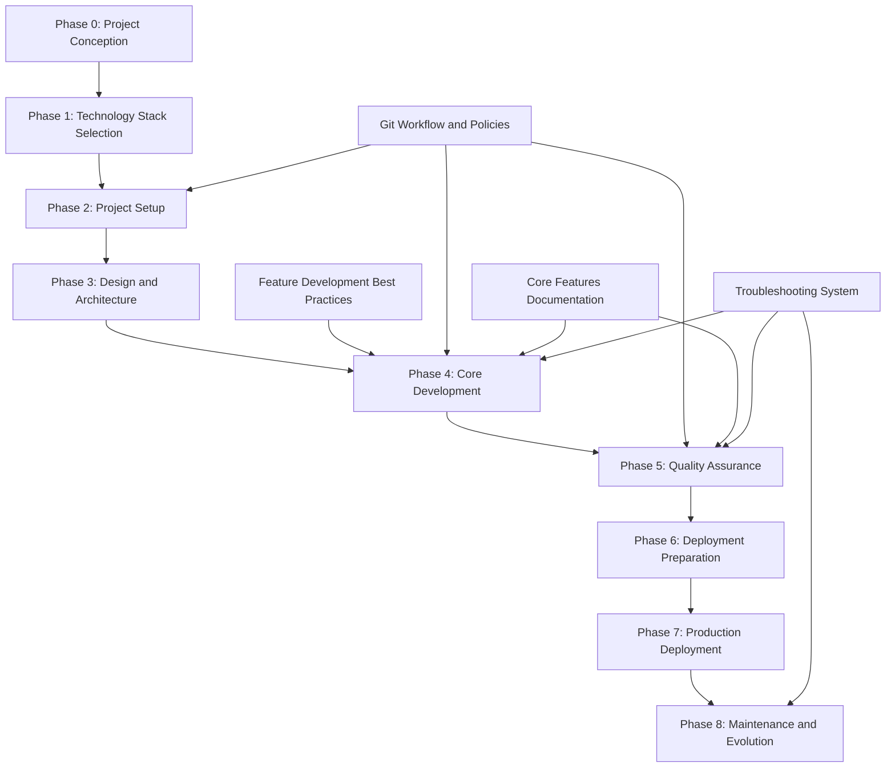

# [Project Name] Development Roadmap

**Project:** [Project Name] - [Brief Project Description]
**Version:** [Version Number]
**Created:** [Creation Date]
**Last Updated:** [Last Update Date]
**Project Lead:** [Project Lead/Team Name]
**Development Approach:** [Project Lifecycle Framework with Feature Development Best Practices and Git Workflow Integration]

## Development Environment Requirements

**[Technology] Version Requirement**: This project requires [Technology] [Version]+ or compatible version.

**Technology Stack Verification**:
```bash
[command] --version  # Should show [version] or higher
[package-manager] --version   # Should show compatible version
```

This setup ensures compatibility with [Framework/Technology], [Language] strict mode, and modern development tools.

## Executive Summary

[Project Name] is a comprehensive [domain/purpose] application that transforms [problem statement] into [solution description]. The project follows the complete 8-phase project lifecycle framework with integrated Feature Development Best Practices and Git Workflow policies.

### Project Scope
- **Total Estimated Duration**: [X] weeks ([Y] months) - Methodology dependent
- **Project Lifecycle Phases**: 8 phases (0-8) with supporting documentation systems
- **Primary Technology Stack**: [Technology Stack]
- **Target Performance**: [Performance Targets]
- **Accessibility Standard**: [Accessibility Standard]
- **Development Framework**: Project Lifecycle Framework with Feature Development and Git Workflow integration

### Success Metrics by Methodology
**MVP/Rapid (2-4 weeks)**:
- **Performance Targets**: [Basic Performance Metrics]
- **Quality Standards**: 80% test coverage, essential features functional
- **User Experience**: Core workflows operational
- **Technical Debt**: Minimal, documented for future enhancement

**Balanced/Standard (4-8 weeks)**:
- **Performance Targets**: [Standard Performance Metrics]
- **Quality Standards**: 90% test coverage, production-ready features
- **User Experience**: Complete user workflows with responsive design
- **Technical Debt**: Managed, with refactoring plan

**Comprehensive/Enterprise (8-12 weeks)**:
- **Performance Targets**: [Enterprise Performance Metrics]
- **Quality Standards**: 95% test coverage, enterprise-grade features
- **User Experience**: Advanced UX with accessibility compliance
- **Technical Debt**: Minimized, with continuous improvement processes

## Project Architecture Overview

### Technology Stack
```
Frontend:
├── Framework: [Frontend Framework]
├── Language: [Programming Language]
├── State Management: [State Management Solution]
├── Styling: CSS Modules + [Design System]
├── Testing: [Testing Framework]
└── Build Tool: [Build Tool]

Backend:
├── Runtime: [Runtime Environment]
├── Framework: [Backend Framework]
├── Database: [Database Solution]
├── ORM: [ORM/Database Layer]
├── Authentication: [Auth Solution]
└── API: [API Architecture]

Infrastructure:
├── Deployment: [Deployment Platform]
├── Database Hosting: [Database Hosting]
├── Monitoring: [Monitoring Tools]
└── CDN: [CDN Solution]
```

### Project Documentation Structure
```
docs/
├── project-lifecycle/           # 8-Phase Project Lifecycle Framework
│   ├── 00-project-conception/   # Phase 0: Initial idea to project definition
│   ├── 01-technology-stack-selection/  # Phase 1: Technology decision-making
│   ├── 02-project-setup/        # Phase 2: Initial project configuration
│   ├── 03-design-and-architecture/     # Phase 3: System design and planning
│   ├── 04-core-development/     # Phase 4: Implementation phases
│   ├── 05-quality-assurance/    # Phase 5: Testing and validation
│   ├── 06-deployment-preparation/      # Phase 6: Production readiness
│   ├── 07-production-deployment/       # Phase 7: Go-live and monitoring
│   ├── 08-maintenance-and-evolution/   # Phase 8: Post-deployment lifecycle
│   ├── feature-development/     # Feature Development Best Practices
│   ├── git-workflow/           # Git Workflow and Policies
│   ├── decision-trees/         # Cross-phase decision support
│   ├── integration-matrices/   # Core feature integration guides
│   └── templates/              # Reusable templates and checklists
├── core-features/              # Core application features documentation
│   ├── authentication/         # Authentication system documentation
│   ├── database/              # Database layer documentation
│   ├── api/                   # API layer documentation
│   ├── state-management/      # State management documentation
│   ├── error-handling/        # Error handling documentation
│   └── testing/               # Testing framework documentation
└── development/               # Development workflow documentation
    ├── troubleshooting/       # Troubleshooting and knowledge management
    └── [existing git guides]  # Enhanced by git-workflow documentation
```

### Feature-Based Application Structure
```
src/
├── features/
│   ├── [feature-1]/
│   │   ├── components/           # [Feature 1] components
│   │   ├── hooks/               # [Feature 1] hooks
│   │   ├── services/            # [Feature 1] services
│   │   ├── types/               # [Feature 1] TypeScript types
│   │   ├── utils/               # [Feature 1] utilities
│   │   ├── store/               # [Feature 1] state management
│   │   ├── tests/               # [Feature 1] tests
│   │   └── README.md            # [Feature 1] documentation
│   ├── [feature-2]/
│   ├── [feature-3]/
│   ├── [feature-4]/
│   └── shared/                  # Shared utilities and components
├── components/                  # Global UI components (design system)
├── lib/                         # Third-party integrations
├── styles/                      # Global styles and design tokens
└── docs/                        # Feature documentation
```

## Development Methodology

### Project Lifecycle Framework Integration

#### Pre-Development Planning Phase
**MANDATORY**: Before any development begins, teams MUST complete the comprehensive Project Lifecycle Framework planning process:

1. **Phase 0: Project Conception Requirements**
   - Complete project conception documentation following Phase 0 guidelines
   - Transform initial ideas into well-defined project requirements
   - Establish clear scope and success criteria using project lifecycle templates
   - Reference: `docs/project-lifecycle/00-project-conception/README.md`

2. **Phase 1: Technology Stack Selection Requirements**
   - Complete technology stack evaluation using Phase 1 methodology
   - Create 3 distinct technology approaches (conservative, modern, hybrid)
   - Include effort estimates, risk assessments, and success probability ratings
   - Reference: `docs/project-lifecycle/01-technology-stack-selection/README.md`

3. **Methodology Selection Decision Matrix**
   ```markdown
   | Criteria | Weight | MVP/Rapid | Balanced/Standard | Comprehensive/Enterprise |
   |----------|--------|-----------|-------------------|-------------------------|
   | Timeline Constraint | 25% | [Score 1-5] | [Score 1-5] | [Score 1-5] |
   | Team Expertise | 20% | [Score 1-5] | [Score 1-5] | [Score 1-5] |
   | Technical Complexity | 20% | [Score 1-5] | [Score 1-5] | [Score 1-5] |
   | Resource Availability | 15% | [Score 1-5] | [Score 1-5] | [Score 1-5] |
   | Risk Tolerance | 10% | [Score 1-5] | [Score 1-5] | [Score 1-5] |
   | Future Scalability | 10% | [Score 1-5] | [Score 1-5] | [Score 1-5] |
   | **Total Weighted Score** | 100% | [Calculated] | [Calculated] | [Calculated] |
   ```

#### Project Lifecycle Framework Integration
**MANDATORY**: Every phase MUST follow the established 8-phase project lifecycle framework with integrated Feature Development and Git Workflow documentation:

```markdown
#### Phase Documentation Integration
[Phase Name] implementation following Project Lifecycle Framework:
- **Phase Documentation**: `docs/project-lifecycle/[phase-number]-[phase-name]/README.md`
- **Feature Development**: `docs/project-lifecycle/feature-development/README.md` (for Phase 4)
- **Git Workflow**: `docs/project-lifecycle/git-workflow/README.md` (all phases)
- **Core Features**: `docs/core-features/[relevant-feature]/README.md`
- **Troubleshooting**: `docs/development/troubleshooting/README.md`

**Integration Points**: [Specific integration with core features, troubleshooting system, and supporting documentation]
```

#### Three-Methodology Approach Guidelines
Each phase implementation must provide three distinct approaches with specific scope boundaries and implementation timelines:

1. **MVP/Rapid Methodology**: 2-4 week total project timeline
   - **Scope**: Essential features only, streamlined processes
   - **Features**: Core functionality, basic UI, standard patterns
   - **Complexity**: Low - proven solutions, minimal dependencies
   - **Risk Level**: Low - well-tested approaches, quick validation
   - **Team Requirements**: 1-2 developers, basic expertise level
   - **Success Criteria**: Functional MVP, basic user workflows, 80% core features
   - **Feature Development**: Streamlined feature development process
   - **Git Workflow**: Simplified Git workflow with essential branches

2. **Balanced/Standard Methodology**: 4-8 week total project timeline
   - **Scope**: Complete features with moderate enhancements
   - **Features**: Core functionality + user experience improvements, responsive design
   - **Complexity**: Medium - modern patterns, selective optimization
   - **Risk Level**: Medium - balanced approach, manageable complexity
   - **Team Requirements**: 2-3 developers, intermediate expertise level
   - **Success Criteria**: Production-ready application, 90% planned features, performance targets met
   - **Feature Development**: Standard feature development lifecycle
   - **Git Workflow**: Comprehensive Git workflow with full branch strategy

3. **Comprehensive/Enterprise Methodology**: 8-12 week total project timeline
   - **Scope**: Full feature set + advanced capabilities, extensive customization
   - **Features**: Complete functionality, advanced UI/UX, optimization, integrations
   - **Complexity**: High - cutting-edge patterns, comprehensive architecture
   - **Risk Level**: High - complex implementation, requires expertise
   - **Team Requirements**: 3-4 developers, advanced expertise level
   - **Success Criteria**: Enterprise-grade solution, 100% features, scalability validated
   - **Feature Development**: Detailed feature development with enterprise considerations
   - **Git Workflow**: Complex Git workflow with security and compliance

#### Individual Development Roadmaps
**MANDATORY**: Each methodology MUST include a detailed "Development Roadmap" sub-section with:

##### Methodology A (MVP/Rapid) - Development Roadmap Template
```markdown
**Week 1**: Foundation & Core Setup
- Days 1-2: Project setup, basic architecture
- Days 3-5: Core feature implementation (Feature X, Feature Y)
- **Deliverable**: Working prototype with core functionality
- **Risk Mitigation**: Daily progress checks, scope validation
- **Resource Allocation**: 1 senior developer (40 hrs)

**Week 2**: Integration & Basic UI
- Days 1-3: Feature integration, basic styling
- Days 4-5: Testing, bug fixes, deployment setup
- **Deliverable**: Functional MVP ready for user testing
- **Risk Mitigation**: Feature freeze, focus on stability
- **Resource Allocation**: 1 senior developer (40 hrs)

**Validation Checkpoints**: End of Week 1 (core features), End of Week 2 (MVP complete)
**Scope Adjustment Points**: Day 3 (feature scope), Day 8 (quality vs. timeline)
```

##### Methodology B (Balanced/Standard) - Development Roadmap Template
```markdown
**Week 1-2**: Foundation & Architecture
- Week 1: Project setup, architecture design, core infrastructure
- Week 2: Database design, API structure, authentication setup
- **Deliverable**: Solid foundation with basic CRUD operations
- **Risk Mitigation**: Architecture review, performance baseline
- **Resource Allocation**: 2 developers (80 hrs total)

**Week 3-4**: Core Feature Development
- Week 3: Primary features implementation (Feature A, Feature B)
- Week 4: Secondary features, integration testing
- **Deliverable**: Core functionality complete, basic UI
- **Risk Mitigation**: Feature prioritization, weekly demos
- **Resource Allocation**: 2 developers (80 hrs total)

**Week 5-6**: Enhancement & Polish
- Week 5: UI/UX improvements, responsive design
- Week 6: Performance optimization, advanced features
- **Deliverable**: Production-ready application
- **Risk Mitigation**: Feature freeze Week 5, focus on quality
- **Resource Allocation**: 2 developers + 1 designer (100 hrs total)

**Validation Checkpoints**: End of Week 2, 4, 6
**Scope Adjustment Points**: Week 2 (architecture), Week 4 (features), Week 5 (enhancements)
```

##### Methodology C (Comprehensive/Enterprise) - Development Roadmap Template
```markdown
**Phase 1 (Week 1-3): Foundation & Architecture**
- Week 1: Requirements analysis, architecture design
- Week 2: Infrastructure setup, development environment
- Week 3: Core framework, database architecture, security setup
- **Deliverable**: Robust foundation with scalable architecture
- **Risk Mitigation**: Architecture review, security audit
- **Resource Allocation**: 3 senior developers (120 hrs total)

**Phase 2 (Week 4-6): Core Development**
- Week 4: Primary feature development (Features A, B, C)
- Week 5: Secondary features, API development
- Week 6: Integration, middleware, business logic
- **Deliverable**: Complete core functionality
- **Risk Mitigation**: Weekly technical reviews, integration testing
- **Resource Allocation**: 3 developers + 1 architect (160 hrs total)

**Phase 3 (Week 7-9): Advanced Features & Integration**
- Week 7: Advanced features, third-party integrations
- Week 8: Performance optimization, caching, monitoring
- Week 9: Security hardening, compliance features
- **Deliverable**: Enterprise-ready features
- **Risk Mitigation**: Security review, performance testing
- **Resource Allocation**: 3 developers + 1 DevOps (160 hrs total)

**Phase 4 (Week 10-12): Quality & Deployment**
- Week 10: Comprehensive testing, bug fixes
- Week 11: Documentation, deployment automation
- Week 12: Final validation, production deployment
- **Deliverable**: Production-deployed enterprise solution
- **Risk Mitigation**: Staged deployment, rollback procedures
- **Resource Allocation**: Full team (180 hrs total)

**Validation Checkpoints**: End of each phase (Weeks 3, 6, 9, 12)
**Scope Adjustment Points**: Week 3 (architecture), Week 6 (features), Week 9 (advanced features)
```

#### Reference Documentation Validation Checklist
Before completing any phase, verify:

**Pre-Development Planning**
- [ ] Implementation Planning & Methodology Selection completed
- [ ] Decision matrix filled out with weighted scores for all criteria
- [ ] Team capacity validated against selected methodology requirements
- [ ] Risk assessment completed for chosen approach
- [ ] Success probability rating documented (minimum 70% for approval)

**Documentation Structure**
- [ ] Foundation document exists: `docs/sandbox/[phase-number]-[phase-folder]/00-[phase-name]-foundation.md`
- [ ] Methodology A document exists: `docs/sandbox/[phase-number]-[phase-folder]/01-[methodology-a-name].md`
- [ ] Methodology B document exists: `docs/sandbox/[phase-number]-[phase-folder]/02-[methodology-b-name].md`
- [ ] Methodology C document exists: `docs/sandbox/[phase-number]-[phase-folder]/03-[methodology-c-name].md`

**Methodology Requirements**
- [ ] Each methodology includes specific scope boundaries (features included/excluded)
- [ ] Timeline estimates align with methodology complexity (A: 2-4 weeks, B: 4-8 weeks, C: 8-12 weeks)
- [ ] Resource allocation requirements clearly defined for each methodology
- [ ] Development roadmap with week-by-week milestones included for each methodology
- [ ] Validation checkpoints and scope adjustment points identified
- [ ] Risk mitigation strategies documented for each phase

**Quality Standards**
- [ ] Selection criteria clearly explain trade-offs between methodologies
- [ ] Each methodology offers distinct approaches (complexity, timeline, features, risk)
- [ ] Success criteria defined and measurable for each methodology
- [ ] Documentation follows the standardized template structure
- [ ] All methodologies are validated and tested approaches
- [ ] Implementation examples or code snippets are provided where applicable
- [ ] Early warning indicators for scope creep documented

#### Success Metrics and Validation Templates

##### Progress Tracking Template
```markdown
## [Methodology X] Progress Tracking

### Week [X] Status Report
**Date**: [Date]
**Phase**: [Current Phase]
**Overall Progress**: [X]% complete

#### Completed Milestones
- [ ] [Milestone 1] - [Completion Date]
- [ ] [Milestone 2] - [Completion Date]
- [ ] [Milestone 3] - [Completion Date]

#### Current Week Objectives
- [ ] [Objective 1] - [Target Date]
- [ ] [Objective 2] - [Target Date]
- [ ] [Objective 3] - [Target Date]

#### Risks and Issues
| Risk/Issue | Impact | Probability | Mitigation | Status |
|------------|--------|-------------|------------|--------|
| [Risk 1] | [High/Med/Low] | [High/Med/Low] | [Action] | [Open/Resolved] |

#### Success Metrics
- **Feature Completion**: [X]% ([X] of [Y] features)
- **Quality Score**: [X]/10 (code review, testing, documentation)
- **Timeline Adherence**: [On Track/At Risk/Behind] ([X] days variance)
- **Scope Stability**: [Stable/Minor Changes/Major Changes]

#### Early Warning Indicators
- [ ] Feature scope increased by >20%
- [ ] Timeline slipped by >3 days
- [ ] Quality metrics below 7/10
- [ ] Team capacity reduced by >25%
- [ ] Technical complexity higher than estimated
```

##### Milestone Validation Template
```markdown
## [Phase Name] Milestone Validation

### Validation Criteria
- [ ] **Functional Requirements**: All planned features working as specified
- [ ] **Quality Standards**: Code review passed, test coverage >80%
- [ ] **Performance Targets**: Response times within acceptable limits
- [ ] **Documentation**: Technical and user documentation complete
- [ ] **Deployment Readiness**: Can be deployed to staging/production

### Validation Results
**Date**: [Date]
**Validator**: [Name/Role]
**Status**: [Pass/Conditional Pass/Fail]

#### Functional Validation
- Feature A: [Pass/Fail] - [Notes]
- Feature B: [Pass/Fail] - [Notes]
- Feature C: [Pass/Fail] - [Notes]

#### Quality Validation
- Code Quality: [Score]/10 - [Notes]
- Test Coverage: [X]% - [Notes]
- Documentation: [Complete/Incomplete] - [Notes]

#### Decision Points
- [ ] **Continue to Next Phase**: All criteria met
- [ ] **Conditional Continue**: Minor issues, continue with monitoring
- [ ] **Scope Adjustment**: Reduce scope to meet timeline
- [ ] **Methodology Change**: Switch to different methodology
- [ ] **Phase Extension**: Extend timeline to meet quality standards

### Next Steps
[Action items and decisions based on validation results]
```

#### AI Assistant Integration Patterns
1. **Feature Implementation Prompts**
   ```
   "Implement [feature name] for [Project Name] following these requirements:
   - [Framework] with [specific configuration]
   - Feature-based folder structure at src/features/[feature-name]/
   - [State Management] for [specific integration]
   - CSS Modules with [design approach]
   - [Coverage]% test coverage with [Testing Framework]
   - [Accessibility Standard] compliance with proper ARIA labels
   - [Performance Target] performance targets for all interactions"
   ```

2. **Code Review Prompts**
   ```
   "Review this [Project Name] implementation for:
   - [Language] strict mode compliance and type safety
   - Performance optimization for [domain-specific] workflows
   - Accessibility compliance for [key features]
   - Test coverage gaps in [core functionality]
   - Error handling for [external integrations]
   - Security considerations for [data handling] and authentication"
   ```

3. **Testing Strategy Prompts**
   ```
   "Create comprehensive tests for [Project Name] [component/feature]:
   - Unit tests for [core logic areas]
   - Integration tests for [workflow areas]
   - E2E tests for complete [user journey types]
   - Performance tests for [performance-critical areas]
   - Accessibility tests for [interaction types]"
   ```

#### Quality Assurance Checkpoints
- **Code Quality**: [Language] strict mode, [Linting Tool] compliance
- **Performance**: [Performance Targets], [Performance Tool] scores [Target Score]
- **Accessibility**: [Accessibility Standard] compliance, keyboard navigation, screen reader support
- **Testing**: [Coverage]% coverage, edge cases, error scenarios, [domain-specific] flows
- **Documentation**: Feature READMEs, API documentation, handoff docs, Reference Documentation

#### Documentation Requirements
1. **Feature Documentation**: README.md for each feature with implementation details
2. **API Documentation**: [API Documentation Standard] for internal and external APIs
3. **Component Documentation**: [Component Documentation Tool] for UI components (future implementation)
4. **Handoff Documentation**: Technical implementation details and architecture decisions
5. **Demo Pages**: Interactive examples for testing [key functionality]
6. **Reference Documentation**: MANDATORY three-methodology approach for every phase (see template above)

### Workflow Optimization
1. **Design-Driven Development**: Integrate design concepts early in development workflow
2. **Sequential Task Execution**: Complete phases in order to maintain feature dependencies
3. **Incremental Handoff Updates**: Update documentation as [domain] features progress
4. **Performance Monitoring**: Built-in performance tracking for [key workflows]
5. **Error Handling**: Comprehensive error boundaries and user feedback for API failures
6. **Accessibility First**: [Accessibility Standard] compliance from initial implementation of all features
7. **CSS Modules Architecture**: Component-scoped styling with design system consistency

## Project Lifecycle Framework Structure

### 8-Phase Dependency Mapping


### Risk Assessment Matrix by Phase
| Phase | Risk Level | Mitigation Strategy | Contingency Plan |
|-------|------------|-------------------|------------------|
| Phase 0: Project Conception | Low | Structured requirements gathering | Scope refinement and stakeholder realignment |
| Phase 1: Technology Stack Selection | Low | Proven technology evaluation framework | Alternative technology stack options |
| Phase 2: Project Setup | Low | Established setup procedures and Git workflow | Alternative infrastructure and simplified setup |
| Phase 3: Design and Architecture | Medium | Design validation and architecture review | Simplified design and modular architecture |
| Phase 4: Core Development | Medium | Feature development best practices and Git workflow | Feature scope reduction and methodology adjustment |
| Phase 5: Quality Assurance | Medium | Comprehensive testing strategy | Extended testing phase and quality gate adjustment |
| Phase 6: Deployment Preparation | Medium | Staged deployment preparation | Simplified deployment and extended preparation |
| Phase 7: Production Deployment | High | Careful deployment with rollback procedures | Immediate rollback and issue resolution |
| Phase 8: Maintenance and Evolution | Low | Continuous monitoring and improvement | Reactive maintenance and feature freeze |

### Resource Allocation by Methodology

#### MVP/Rapid (2-4 weeks)
- **Development Time**: [X] hours/week team capacity (1-2 developers)
- **Feature Development**: Streamlined process, essential features only
- **Git Workflow**: Simplified branching, fast integration
- **Testing Time**: 20% of development time (basic coverage)
- **Documentation Time**: 10% of development time (essential docs)
- **Buffer Time**: 15% for unexpected issues

#### Balanced/Standard (4-8 weeks)
- **Development Time**: [X] hours/week team capacity (2-3 developers)
- **Feature Development**: Standard lifecycle, comprehensive features
- **Git Workflow**: Full branching strategy, code review process
- **Testing Time**: 30% of development time (comprehensive coverage)
- **Documentation Time**: 20% of development time (complete docs)
- **Buffer Time**: 20% for unexpected issues and optimization

#### Comprehensive/Enterprise (8-12 weeks)
- **Development Time**: [X] hours/week team capacity (3-4 developers)
- **Feature Development**: Detailed process, enterprise features
- **Git Workflow**: Complex workflow, security and compliance
- **Testing Time**: 40% of development time (extensive coverage)
- **Documentation Time**: 25% of development time (comprehensive docs)
- **Buffer Time**: 25% for unexpected issues and enterprise requirements

## Project Lifecycle Implementation

### Phase 0: Project Conception (Week 1)
**Duration**: 1 week
**Priority**: Critical
**Dependencies**: None
**Risk Level**: Low
**Documentation**: `docs/project-lifecycle/00-project-conception/README.md`

#### Overview
Transform initial ideas into well-defined project requirements with clear scope and success criteria. This phase establishes the foundation for all subsequent development work.

#### Key Deliverables
- [ ] **Problem Definition and Solution Validation**
  - Clear problem statement and target audience identification
  - Solution approach validation and feasibility assessment
  - Business requirements and success criteria definition
  - Stakeholder identification and requirements gathering

- [ ] **Initial Scope Definition and Constraint Analysis**
  - Project scope boundaries and feature prioritization
  - Technical constraints and resource limitations assessment
  - Timeline constraints and delivery expectations
  - Risk assessment and mitigation strategies

#### Methodology-Specific Outcomes
- **MVP/Rapid**: Essential problem definition, basic scope
- **Balanced/Standard**: Comprehensive requirements, detailed scope
- **Comprehensive/Enterprise**: Extensive analysis, enterprise requirements

### Phase 1: Technology Stack Selection (Week 1.5-2)
**Duration**: 0.5 weeks
**Priority**: Critical
**Dependencies**: Phase 0
**Risk Level**: Low
**Documentation**: `docs/project-lifecycle/01-technology-stack-selection/README.md`

#### Overview
Make informed technology decisions that will guide all subsequent development phases. Evaluate and select the optimal technical foundation for the project requirements.

#### Key Deliverables
- [ ] **Technology Evaluation and Selection**
  - Frontend and backend technology comparison
  - Database technology assessment and selection
  - Development tooling and framework evaluation
  - Integration and compatibility analysis

- [ ] **Technology Decision Documentation**
  - Technology selection rationale and trade-offs
  - Performance implications and scalability projections
  - Team expertise alignment and learning requirements
  - Long-term maintenance and evolution considerations

#### Methodology-Specific Approaches
- **MVP/Rapid**: Conservative, proven technology choices
- **Balanced/Standard**: Modern, well-supported technology mix
- **Comprehensive/Enterprise**: Cutting-edge, enterprise-grade technology stack

### Phase 2: Project Setup (Weeks 2-3)
**Duration**: 1 week
**Priority**: Critical
**Dependencies**: Phase 1
**Risk Level**: Low
**Documentation**: `docs/project-lifecycle/02-project-setup/README.md`
**Git Workflow**: `docs/project-lifecycle/git-workflow/README.md`

#### Overview
Establish the development environment and project infrastructure using selected technologies. Implement Git workflow and development best practices from the start.

#### Key Deliverables
- [ ] **Development Environment Setup**
  - [Framework] project initialization with selected configuration
  - [Language] strict mode configuration and compiler setup
  - [Linting Tool], [Formatting Tool], and pre-commit hooks configuration
  - [Repository Platform] repository with Git workflow implementation

- [ ] **Git Workflow Implementation**
  - Branching strategy establishment per Git workflow documentation
  - Pull request templates and code review process setup
  - Commit message conventions implementation
  - CI/CD pipeline initial configuration

- [ ] **Project Structure & Architecture Foundation**
  - Feature-based architecture planning and setup
  - Core features documentation structure establishment
  - Environment variable management and secrets handling
  - Configuration files for different environments

#### Git Workflow Integration
- **Branching Strategy**: Implement methodology-specific branching per `docs/project-lifecycle/git-workflow/branching-strategies.md`
- **Commit Conventions**: Follow standardized commit messages per `docs/project-lifecycle/git-workflow/commit-conventions.md`
- **Review Process**: Establish PR workflow per `docs/project-lifecycle/git-workflow/pull-request-templates.md`

#### Performance/Planning Targets
- [ ] Project initialization completes within 30 minutes (setup target)
- [ ] Development server starts within 10 seconds (performance target)
- [ ] Build process completes within 2 minutes (efficiency target)
- [ ] Zero security vulnerabilities in initial dependencies (security requirement)
- [ ] Git workflow operational with first commits following conventions

#### Acceptance Criteria
- [ ] All dependencies install without conflicts or security warnings
- [ ] Development server starts successfully with hot reload functionality
- [ ] [Language] compilation passes without errors in strict mode
- [ ] Git workflow implemented and documented
- [ ] Initial project structure follows feature-based architecture
- [ ] CI/CD pipeline configured and operational

### Phase 3: Design and Architecture (Weeks 3-4)
**Duration**: 1 week
**Priority**: High
**Dependencies**: Phase 2
**Risk Level**: Medium
**Documentation**: `docs/project-lifecycle/03-design-and-architecture/README.md`

#### Overview
Create comprehensive system design and architecture that will guide implementation. Establish design patterns, data models, and integration strategies.

#### Key Deliverables
- [ ] **System Architecture Design**
  - Application architecture and component design
  - Data model and database schema design
  - API design and integration patterns
  - Security architecture and authentication design

- [ ] **User Experience and Interface Design**
  - User workflow and experience design
  - Interface design and component library planning
  - Responsive design and accessibility considerations
  - Design system and styling architecture

#### Core Features Integration Planning
- **Authentication**: Design authentication flows and security patterns
- **Database**: Plan database schema and data relationships
- **API**: Design API endpoints and data contracts
- **State Management**: Plan state architecture and data flow
- **Error Handling**: Design error handling and user feedback patterns
- **Testing**: Plan testing strategy and coverage approach

#### Methodology-Specific Depth
- **MVP/Rapid**: Basic architecture, essential design patterns
- **Balanced/Standard**: Comprehensive architecture, detailed design
- **Comprehensive/Enterprise**: Advanced architecture, enterprise patterns

### Phase 4: Core Development (Weeks 4-8)
**Duration**: 4 weeks (methodology-dependent)
**Priority**: Critical
**Dependencies**: Phase 3
**Risk Level**: Medium
**Documentation**: `docs/project-lifecycle/04-core-development/README.md`
**Feature Development**: `docs/project-lifecycle/feature-development/README.md`
**Git Workflow**: `docs/project-lifecycle/git-workflow/README.md`

#### Overview
Implement core application features using established patterns from core features documentation. This is the primary implementation phase where requirements are transformed into working application.

#### Key Deliverables by Methodology

**MVP/Rapid (1-2 weeks)**:
- [ ] **Essential Features Implementation**
  - Core feature functionality using streamlined feature development process
  - Basic authentication and data persistence
  - Simple UI components and user workflows
  - Essential error handling and basic testing

**Balanced/Standard (2-3 weeks)**:
- [ ] **Comprehensive Features Implementation**
  - Complete feature set using standard feature development lifecycle
  - Full authentication system and optimized database layer
  - Responsive UI components and complete user workflows
  - Comprehensive error handling and testing coverage

**Comprehensive/Enterprise (3-4 weeks)**:
- [ ] **Enterprise Features Implementation**
  - Advanced feature set using detailed feature development process
  - Enterprise authentication and advanced database architecture
  - Advanced UI/UX and complex user workflows
  - Enterprise error handling and extensive testing

#### Feature Development Integration
- **Feature Planning**: Use `docs/project-lifecycle/feature-development/feature-planning-template.md`
- **Development Workflow**: Follow `docs/project-lifecycle/feature-development/README.md` guidelines
- **Feature Completion**: Validate using `docs/project-lifecycle/feature-development/feature-completion-checklist.md`
- **Core Features**: Integrate with `docs/core-features/[feature]/README.md` documentation

#### Git Workflow Integration
- **Branch Management**: Follow methodology-specific branching strategies
- **Commit Standards**: Use standardized commit message conventions
- **Code Review**: Implement PR workflow with methodology-specific templates
- **Integration**: Manage feature integration and conflict resolution

#### Core Features Implementation
- [ ] **Authentication System** (`docs/core-features/authentication/`)
- [ ] **Database Layer** (`docs/core-features/database/`)
- [ ] **API Layer** (`docs/core-features/api/`)
- [ ] **State Management** (`docs/core-features/state-management/`)
- [ ] **Error Handling** (`docs/core-features/error-handling/`)
- [ ] **Testing Suite** (`docs/core-features/testing/`)

#### Quality Gates and Validation
- [ ] Feature completion checklists validated
- [ ] Code review and quality standards met
- [ ] Testing coverage meets methodology requirements
- [ ] Performance targets achieved
- [ ] Security requirements satisfied
- [ ] Documentation updated and complete
### Phase 5: Quality Assurance (Weeks 8-9)
**Duration**: 1 week (methodology-dependent)
**Priority**: Critical
**Dependencies**: Phase 4
**Risk Level**: Medium
**Documentation**: `docs/project-lifecycle/05-quality-assurance/README.md`

#### Overview
Comprehensive testing and validation to ensure application quality, performance, and reliability before deployment preparation.

#### Key Deliverables
- [ ] **Testing and Validation**
  - Comprehensive testing execution (unit, integration, E2E)
  - Performance testing and optimization
  - Security testing and vulnerability assessment
  - Accessibility testing and compliance validation
  - User acceptance testing (UAT) execution

- [ ] **Quality Gates and Metrics**
  - Quality metrics dashboard and reporting
  - Pre-deployment verification and validation
  - Performance benchmarking and optimization
  - Security audit and compliance verification

#### Methodology-Specific Testing
- **MVP/Rapid**: Essential testing, basic performance validation
- **Balanced/Standard**: Comprehensive testing, performance optimization
- **Comprehensive/Enterprise**: Extensive testing, enterprise validation

### Phase 6: Deployment Preparation (Weeks 9-10)
**Duration**: 1 week
**Priority**: High
**Dependencies**: Phase 5
**Risk Level**: Medium
**Documentation**: `docs/project-lifecycle/06-deployment-preparation/README.md`

#### Overview
Prepare production environment and establish deployment procedures for reliable application deployment.

#### Key Deliverables
- [ ] **Production Environment Setup**
  - Production environment configuration and setup
  - Deployment pipeline configuration and automation
  - Monitoring and alerting implementation
  - Security hardening and compliance verification

- [ ] **Deployment Procedures**
  - Backup and recovery procedures
  - Go-live checklist and rollback procedures
  - Performance monitoring and alerting setup
  - Production support procedures establishment

### Phase 7: Production Deployment (Week 10)
**Duration**: 1-3 days
**Priority**: Critical
**Dependencies**: Phase 6
**Risk Level**: High
**Documentation**: `docs/project-lifecycle/07-production-deployment/README.md`

#### Overview
Execute go-live procedures and establish production operations with careful monitoring and validation.

#### Key Deliverables
- [ ] **Production Deployment Execution**
  - Production deployment execution and validation
  - Monitoring and alerting activation
  - Post-deployment validation and performance verification
  - Production support procedures activation

- [ ] **Go-Live Management**
  - Performance baseline establishment
  - User communication and rollout management
  - Incident response procedures activation
  - Success metrics monitoring and reporting

### Phase 8: Maintenance and Evolution (Ongoing)
**Duration**: Ongoing
**Priority**: Medium
**Dependencies**: Phase 7
**Risk Level**: Low
**Documentation**: `docs/project-lifecycle/08-maintenance-and-evolution/README.md`

#### Overview
Long-term lifecycle management, feature evolution, and system optimization for continued success.

#### Key Deliverables
- [ ] **Continuous Operations**
  - Performance monitoring and continuous optimization
  - Security updates and patch management
  - User feedback collection and integration
  - System scaling and infrastructure evolution

- [ ] **Evolution and Enhancement**
  - Feature enhancement and evolution planning
  - Technical debt management and refactoring
  - Long-term strategic planning and technology evolution
  - Knowledge management and team development

#### Integration with Supporting Systems
- **Feature Development**: Ongoing feature development using established best practices
- **Git Workflow**: Continued use of Git workflow for maintenance and enhancements
- **Troubleshooting**: Active use of troubleshooting system for issue resolution
- **Core Features**: Continuous enhancement of core features documentation

---

## Template Usage Instructions

### How to Use This Enhanced Template

1. **Complete Project Lifecycle Framework Planning**: Start with Phase 0 (Project Conception) following the complete 8-phase framework
2. **Replace All Placeholders**: Search for text in square brackets `[like this]` and replace with project-specific information
3. **Select Appropriate Methodology**: Use the decision matrix to choose between MVP/Rapid, Balanced/Standard, or Comprehensive/Enterprise
4. **Follow 8-Phase Structure**: Implement all phases (0-8) with methodology-specific timelines and depth
5. **Integrate Supporting Documentation**: Use Feature Development Best Practices and Git Workflow documentation throughout
6. **Implement Progress Tracking**: Use provided templates for milestone validation and progress tracking
7. **Monitor Scope and Timeline**: Utilize validation checkpoints and scope adjustment points to prevent scope creep
8. **Validate Completeness**: Use the enhanced validation checklists for each phase

### Critical Template Requirements

#### Project Lifecycle Framework Compliance
- [ ] All 8 phases (0-8) implemented following project lifecycle documentation
- [ ] Phase 0 (Project Conception) completed before any development starts
- [ ] Phase 1 (Technology Stack Selection) completed with methodology selection
- [ ] Phase 2 (Project Setup) includes Git workflow implementation
- [ ] Phase 4 (Core Development) integrates Feature Development Best Practices
- [ ] All phases reference appropriate core features documentation
- [ ] Troubleshooting system integration planned and implemented

#### Feature Development Integration Compliance
- [ ] Phase 4 uses Feature Development Best Practices documentation
- [ ] Feature planning templates used for all features
- [ ] Feature completion checklists validated for all features
- [ ] Core features integration documented and implemented
- [ ] Quality gates and standards applied consistently
- [ ] Feature development workflow integrated with Git workflow

#### Git Workflow Integration Compliance
- [ ] Git workflow policies implemented from Phase 2 onwards
- [ ] Branching strategies follow methodology-specific guidelines
- [ ] Commit message conventions implemented and followed
- [ ] Pull request templates used for all code reviews
- [ ] Merge strategies and conflict resolution procedures established
- [ ] CI/CD integration with Git workflow implemented

#### Supporting Documentation Integration Compliance
- [ ] Core features documentation referenced and integrated
- [ ] Troubleshooting system workflows established
- [ ] Knowledge management processes implemented
- [ ] Cross-system integration documented and validated

#### Progress Tracking and Validation Compliance
- [ ] Progress tracking templates implemented for selected methodology
- [ ] Milestone validation checkpoints scheduled and documented
- [ ] Early warning indicators for scope creep identified and monitored
- [ ] Success metrics defined and measurable for each phase
- [ ] Scope adjustment decision points clearly marked in timeline

#### Quality Assurance Integration
- [ ] Performance/Planning Targets are specific and measurable
- [ ] Acceptance Criteria are clear and testable
- [ ] Dependencies between phases are clearly mapped
- [ ] Risk assessment includes mitigation strategies
- [ ] Quality gates integrated with Feature Development best practices

#### Customization Guidelines
- [ ] Technology stack placeholders are replaced with actual technologies
- [ ] Project-specific features and requirements are incorporated
- [ ] Timeline estimates reflect realistic development capacity
- [ ] Success metrics align with business objectives
- [ ] Documentation requirements match team workflow and project lifecycle framework

### Enhanced Template Validation Checklist

Before using this template for a new project, ensure:

**Project Lifecycle Framework Integration**
- [ ] All 8 phases (0-8) are included and properly sequenced
- [ ] Phase documentation references are correct and accessible
- [ ] Feature Development Best Practices integration is planned
- [ ] Git Workflow and Policies integration is implemented
- [ ] Core features documentation is referenced appropriately
- [ ] Troubleshooting system integration is established

**Methodology Definition and Scope**
- [ ] All three methodologies have clear scope boundaries and timeline estimates
- [ ] MVP/Rapid methodology: 2-4 weeks total, streamlined processes
- [ ] Balanced/Standard methodology: 4-8 weeks total, comprehensive approach
- [ ] Comprehensive/Enterprise methodology: 8-12 weeks total, detailed implementation
- [ ] Resource allocation requirements specified for each methodology
- [ ] Methodology-specific feature development approaches documented

**Documentation System Integration**
- [ ] Feature Development templates and checklists are referenced
- [ ] Git workflow documentation is integrated throughout phases
- [ ] Core features documentation links are accurate and complete
- [ ] Troubleshooting workflows are established and documented
- [ ] Knowledge management processes are defined and integrated

**Project Customization and Validation**
- [ ] All `[placeholder text]` has been replaced with project-specific content
- [ ] Phase dependencies are logical and follow the 8-phase structure
- [ ] Performance targets are realistic and methodology-appropriate
- [ ] Success metrics align with business objectives and methodology scope
- [ ] Timeline estimates include appropriate buffer time

**Quality and Risk Management**
- [ ] Risk assessment covers all phases and methodology-specific risks
- [ ] Quality gates align with Feature Development best practices
- [ ] Early warning indicators for scope creep defined for each methodology
- [ ] Validation checkpoints align with project lifecycle milestones
- [ ] Scope adjustment decision points clearly identified and documented

**Resource and Timeline Validation**
- [ ] Resource allocation reflects actual team capacity and methodology requirements
- [ ] Timeline estimates are realistic for selected methodology
- [ ] Feature development workflows are integrated with overall timeline
- [ ] Git workflow overhead is accounted for in time estimates
- [ ] Progress tracking templates are customized for project and methodology needs

---

## Additional Template Sections

### Testing Strategy Template
```typescript
// [Project Name] testing configuration template
interface [ProjectName]TestingFramework {
  unit: {
    framework: '[Testing Framework]';
    utilities: '[Testing Utilities]';
    coverage: {
      statements: [X];
      branches: [X];
      functions: [X];
      lines: [X];
    };
    focus: [
      '[Test focus area 1]',
      '[Test focus area 2]',
      '[Test focus area 3]'
    ];
  };
  integration: {
    framework: '[Integration Testing Framework]';
    mocking: '[Mocking Solution]';
    apiTesting: '[API Testing Tool]';
  };
  e2e: {
    framework: '[E2E Testing Framework]';
    browsers: ['[Browser 1]', '[Browser 2]'];
    devices: ['[Device 1]', '[Device 2]'];
  };
}
```

### Success Metrics Template
| Metric Category | Month 3 Target | Month 6 Target | Month 12 Target |
|-----------------|----------------|----------------|-----------------|
| **[Metric Category 1]** | [Target] | [Target] | [Target] |
| **[Metric Category 2]** | [Target] | [Target] | [Target] |
| **[Metric Category 3]** | [Target] | [Target] | [Target] |

---

## Integration Summary

### Complete Documentation System Integration

This enhanced roadmap template provides seamless integration with:

#### Project Lifecycle Framework (8 Phases)
- **Phase 0**: Project Conception - `docs/project-lifecycle/00-project-conception/`
- **Phase 1**: Technology Stack Selection - `docs/project-lifecycle/01-technology-stack-selection/`
- **Phase 2**: Project Setup - `docs/project-lifecycle/02-project-setup/`
- **Phase 3**: Design and Architecture - `docs/project-lifecycle/03-design-and-architecture/`
- **Phase 4**: Core Development - `docs/project-lifecycle/04-core-development/`
- **Phase 5**: Quality Assurance - `docs/project-lifecycle/05-quality-assurance/`
- **Phase 6**: Deployment Preparation - `docs/project-lifecycle/06-deployment-preparation/`
- **Phase 7**: Production Deployment - `docs/project-lifecycle/07-production-deployment/`
- **Phase 8**: Maintenance and Evolution - `docs/project-lifecycle/08-maintenance-and-evolution/`

#### Supporting Documentation Systems
- **Feature Development Best Practices** - `docs/project-lifecycle/feature-development/`
  - Feature planning templates and completion checklists
  - Development workflow and quality gates
  - Core features integration guidance
- **Git Workflow and Policies** - `docs/project-lifecycle/git-workflow/`
  - Branching strategies and commit conventions
  - Pull request templates and review processes
  - Merge strategies and conflict resolution

#### Core Features Documentation
- **Authentication** - `docs/core-features/authentication/`
- **Database** - `docs/core-features/database/`
- **API** - `docs/core-features/api/`
- **State Management** - `docs/core-features/state-management/`
- **Error Handling** - `docs/core-features/error-handling/`
- **Testing** - `docs/core-features/testing/`

#### Troubleshooting and Knowledge Management
- **Active Blockers** - `docs/development/troubleshooting/active-blockers/`
- **Resolved Issues** - `docs/development/troubleshooting/resolved-issues/`
- **Knowledge Base** - `docs/development/troubleshooting/`

### Methodology-Specific Implementation Guidance

#### MVP/Rapid (2-4 weeks)
- Streamlined 8-phase implementation with essential deliverables
- Basic Feature Development workflow with simplified quality gates
- Essential Git workflow with fast integration processes
- Core features implementation with minimal customization

#### Balanced/Standard (4-8 weeks)
- Complete 8-phase implementation with comprehensive deliverables
- Standard Feature Development lifecycle with balanced quality gates
- Full Git workflow with comprehensive branching and review processes
- Core features implementation with moderate customization

#### Comprehensive/Enterprise (8-12 weeks)
- Detailed 8-phase implementation with extensive deliverables
- Advanced Feature Development process with enterprise quality gates
- Complex Git workflow with security and compliance considerations
- Core features implementation with extensive customization and optimization

---

**End of Enhanced Template**

*This enhanced template ensures comprehensive roadmap creation with full integration of the 8-phase Project Lifecycle Framework, Feature Development Best Practices, Git Workflow and Policies, and all supporting documentation systems. It provides methodology-specific guidance while maintaining consistency and completeness across all project roadmaps, bridging high-level planning with practical development execution.*