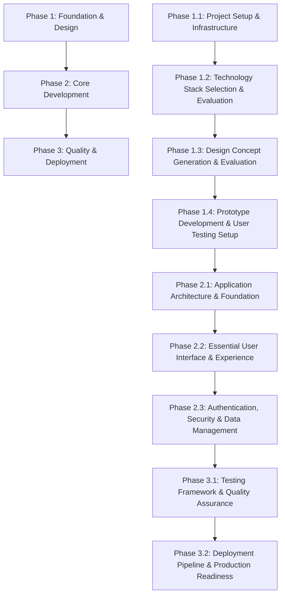

# [Project Name] Development Roadmap

**Project:** [Project Name] - [Brief Project Description]
**Version:** [Version Number]
**Created:** [Creation Date]
**Last Updated:** [Last Update Date]
**Project Lead:** [Project Lead/Team Name]
**Development Approach:** [Design-driven Development Methodology with AI Assistant Integration]

## Development Environment Requirements

**[Technology] Version Requirement**: This project requires [Technology] [Version]+ or compatible version.

**Technology Stack Verification**:
```bash
[command] --version  # Should show [version] or higher
[package-manager] --version   # Should show compatible version
```

This setup ensures compatibility with [Framework/Technology], [Language] strict mode, and modern development tools.

## Executive Summary

[Project Name] is a comprehensive [domain/purpose] application that transforms [problem statement] into [solution description]. The project emphasizes [key feature 1], [key feature 2], [key feature 3], and [key feature 4].

### Project Scope
- **Total Estimated Duration**: [X] weeks ([Y] months)
- **Number of Phases**: [X] phases with [Y] sub-phases
- **Primary Technology Stack**: [Technology Stack]
- **Target Performance**: [Performance Targets]
- **Accessibility Standard**: [Accessibility Standard]
- **Development Methodology**: [Design-driven methodology] with AI assistant integration

### Success Metrics
- **Performance Targets**: [Performance Metrics]
- **Quality Standards**: [Quality Metrics]
- **User Experience**: [UX Metrics]
- **Technical Debt**: [Technical Standards]

## Project Architecture Overview

### Technology Stack
```
Frontend:
├── Framework: [Frontend Framework]
├── Language: [Programming Language]
├── State Management: [State Management Solution]
├── Styling: CSS Modules + [Design System]
├── Testing: [Testing Framework]
└── Build Tool: [Build Tool]

Backend:
├── Runtime: [Runtime Environment]
├── Framework: [Backend Framework]
├── Database: [Database Solution]
├── ORM: [ORM/Database Layer]
├── Authentication: [Auth Solution]
└── API: [API Architecture]

Infrastructure:
├── Deployment: [Deployment Platform]
├── Database Hosting: [Database Hosting]
├── Monitoring: [Monitoring Tools]
└── CDN: [CDN Solution]
```

### Feature-Based Folder Structure
```
src/
├── features/
│   ├── [feature-1]/
│   │   ├── components/           # [Feature 1] components
│   │   ├── hooks/               # [Feature 1] hooks
│   │   ├── services/            # [Feature 1] services
│   │   ├── types/               # [Feature 1] TypeScript types
│   │   ├── utils/               # [Feature 1] utilities
│   │   ├── store/               # [Feature 1] state management
│   │   ├── tests/               # [Feature 1] tests
│   │   └── README.md            # [Feature 1] documentation
│   ├── [feature-2]/
│   ├── [feature-3]/
│   ├── [feature-4]/
│   └── shared/                  # Shared utilities and components
├── components/                  # Global UI components (design system)
├── lib/                         # Third-party integrations
├── styles/                      # Global styles and design tokens
└── docs/                        # Feature documentation
```

## Development Methodology

### Solo Development with AI Assistants

#### Reference Documentation Requirements
**MANDATORY**: Every phase and sub-phase MUST include a Reference Documentation section with three alternative methodologies following this exact structure:

```markdown
#### Reference Documentation
[Phase/Feature name] with three alternative [implementation/approach] methodologies:
- **Foundation**: `docs/sandbox/[phase-number]-[phase-folder]/00-[phase-name]-foundation.md`
- **Methodology A**: `docs/sandbox/[phase-number]-[phase-folder]/01-[methodology-a-name].md` ([Brief description of approach A])
- **Methodology B**: `docs/sandbox/[phase-number]-[phase-folder]/02-[methodology-b-name].md` ([Brief description of approach B])
- **Methodology C**: `docs/sandbox/[phase-number]-[phase-folder]/03-[methodology-c-name].md` ([Brief description of approach C])

**Selection Criteria**: [Guidance for choosing between methodologies based on project constraints, team expertise, timeline, and business requirements]
```

#### Three-Methodology Approach Guidelines
Each Reference Documentation section must provide three distinct approaches that offer different trade-offs:

1. **Methodology A**: [Conservative/Simple/Proven approach]
   - Lower complexity, faster implementation
   - Proven patterns, minimal risk
   - May sacrifice some performance or features for simplicity

2. **Methodology B**: [Balanced/Modern/Optimized approach]
   - Moderate complexity, balanced implementation
   - Modern patterns with good performance
   - Balances features, performance, and maintainability

3. **Methodology C**: [Advanced/Complex/High-performance approach]
   - Higher complexity, comprehensive implementation
   - Cutting-edge patterns, maximum performance
   - May require more expertise and maintenance overhead

#### Reference Documentation Validation Checklist
Before completing any phase, verify:
- [ ] Foundation document exists: `docs/sandbox/[phase-number]-[phase-folder]/00-[phase-name]-foundation.md`
- [ ] Methodology A document exists: `docs/sandbox/[phase-number]-[phase-folder]/01-[methodology-a-name].md`
- [ ] Methodology B document exists: `docs/sandbox/[phase-number]-[phase-folder]/02-[methodology-b-name].md`
- [ ] Methodology C document exists: `docs/sandbox/[phase-number]-[phase-folder]/03-[methodology-c-name].md`
- [ ] Selection criteria clearly explain trade-offs between methodologies
- [ ] Each methodology offers distinct approaches (complexity, performance, cost, maintenance)
- [ ] Documentation follows the standardized template structure
- [ ] All methodologies are validated and tested approaches
- [ ] Implementation examples or code snippets are provided where applicable

#### AI Assistant Integration Patterns
1. **Feature Implementation Prompts**
   ```
   "Implement [feature name] for [Project Name] following these requirements:
   - [Framework] with [specific configuration]
   - Feature-based folder structure at src/features/[feature-name]/
   - [State Management] for [specific integration]
   - CSS Modules with [design approach]
   - [Coverage]% test coverage with [Testing Framework]
   - [Accessibility Standard] compliance with proper ARIA labels
   - [Performance Target] performance targets for all interactions"
   ```

2. **Code Review Prompts**
   ```
   "Review this [Project Name] implementation for:
   - [Language] strict mode compliance and type safety
   - Performance optimization for [domain-specific] workflows
   - Accessibility compliance for [key features]
   - Test coverage gaps in [core functionality]
   - Error handling for [external integrations]
   - Security considerations for [data handling] and authentication"
   ```

3. **Testing Strategy Prompts**
   ```
   "Create comprehensive tests for [Project Name] [component/feature]:
   - Unit tests for [core logic areas]
   - Integration tests for [workflow areas]
   - E2E tests for complete [user journey types]
   - Performance tests for [performance-critical areas]
   - Accessibility tests for [interaction types]"
   ```

#### Quality Assurance Checkpoints
- **Code Quality**: [Language] strict mode, [Linting Tool] compliance
- **Performance**: [Performance Targets], [Performance Tool] scores [Target Score]
- **Accessibility**: [Accessibility Standard] compliance, keyboard navigation, screen reader support
- **Testing**: [Coverage]% coverage, edge cases, error scenarios, [domain-specific] flows
- **Documentation**: Feature READMEs, API documentation, handoff docs, Reference Documentation

#### Documentation Requirements
1. **Feature Documentation**: README.md for each feature with implementation details
2. **API Documentation**: [API Documentation Standard] for internal and external APIs
3. **Component Documentation**: [Component Documentation Tool] for UI components (future implementation)
4. **Handoff Documentation**: Technical implementation details and architecture decisions
5. **Demo Pages**: Interactive examples for testing [key functionality]
6. **Reference Documentation**: MANDATORY three-methodology approach for every phase (see template above)

### Workflow Optimization
1. **Design-Driven Development**: Integrate design concepts early in development workflow
2. **Sequential Task Execution**: Complete phases in order to maintain feature dependencies
3. **Incremental Handoff Updates**: Update documentation as [domain] features progress
4. **Performance Monitoring**: Built-in performance tracking for [key workflows]
5. **Error Handling**: Comprehensive error boundaries and user feedback for API failures
6. **Accessibility First**: [Accessibility Standard] compliance from initial implementation of all features
7. **CSS Modules Architecture**: Component-scoped styling with design system consistency

## Phase Structure and Dependencies

### Dependency Mapping


### Risk Assessment Matrix
| Phase | Risk Level | Mitigation Strategy | Contingency Plan |
|-------|------------|-------------------|------------------|
| Phase 1: Foundation & Design | Low | Proven [Technology Stack] and design methodologies | Alternative [infrastructure options] and simplified design concepts |
| Phase 2: Core Development | Medium | Incremental feature development with user testing | Feature scope reduction and MVP approach |
| Phase 3: Quality & Deployment | Medium | Comprehensive testing strategy and staged deployment | Extended testing phase and gradual rollout |

### Resource Allocation
- **Development Time**: [X] hours/week team capacity
- **AI Assistant Usage**: [Y] hours/week for complex implementations
- **Testing Time**: [Z]% of development time ([Hours] hours/week)
- **Documentation Time**: [Z]% of development time ([Hours] hours/week)
- **Buffer Time**: [Z]% for unexpected issues and [external dependency] challenges

## Phase 1: Foundation & Design (Weeks 1-7)

**Duration**: 7 weeks
**Priority**: Critical
**Dependencies**: None
**Risk Level**: Low

### Phase 1.1: Project Setup & Infrastructure (Weeks 1-2)
**Duration**: 2 weeks
**Status**: 🔄 Planned

#### Overview
This phase establishes the foundational development environment and project infrastructure. The goal is to create a robust, scalable project setup with industry-standard tooling and prepare for efficient development workflows.

#### Deliverables
- [ ] **Development Environment Setup**
  - [Framework] project initialization with modern configuration
  - [Language] strict mode configuration and compiler setup
  - [Linting Tool], [Formatting Tool], and pre-commit hooks configuration
  - [Repository Platform] repository with proper .gitignore and README

- [ ] **Core Dependencies Installation**
  - Package manager configuration ([Package Manager])
  - Essential dependencies for [Framework] and [Language]
  - Development dependencies for testing and code quality
  - Security audit and vulnerability scanning setup

- [ ] **Project Structure & Architecture**
  - Industry-standard folder structure implementation
  - Feature-based architecture planning and setup
  - Environment variable management and secrets handling
  - Configuration files for different environments (dev, staging, prod)

- [ ] **Version Control & Collaboration Setup**
  - Git workflow and branching strategy establishment
  - Pull request templates and code review guidelines
  - Issue templates and project management integration
  - Documentation standards and contribution guidelines

#### Reference Documentation
**MANDATORY**: Project setup and infrastructure approaches are documented with alternative methodologies:
- **Foundation**: `docs/sandbox/01-project-setup/00-project-setup-foundation.md`
- **Methodology A**: `docs/sandbox/01-project-setup/01-monorepo-first-methodology.md` (Single repository, comprehensive setup approach)
- **Methodology B**: `docs/sandbox/01-project-setup/02-microservices-architecture-methodology.md` (Distributed services, modular setup approach)
- **Methodology C**: `docs/sandbox/01-project-setup/03-modular-monolith-methodology.md` (Hybrid modular, balanced setup approach)

**Selection Criteria**: Choose methodology based on team size, project complexity, deployment requirements, and long-term maintenance considerations. Evaluate each approach against scalability needs and development workflow preferences.

#### Performance/Planning Targets
- [ ] Project initialization completes within 30 minutes (setup target)
- [ ] Development server starts within 10 seconds (performance target)
- [ ] Build process completes within 2 minutes (efficiency target)
- [ ] Zero security vulnerabilities in initial dependencies (security requirement)

#### Acceptance Criteria
- [ ] All dependencies install without conflicts or security warnings
- [ ] Development server starts successfully with hot reload functionality
- [ ] [Language] compilation passes without errors in strict mode
- [ ] Linting and formatting tools execute without violations
- [ ] Version control workflow documented and tested

#### AI Assistant Prompts
```
"Set up [Project Name] development environment with [Technology Stack]:
- [Framework] configuration with modern best practices and performance optimization
- [Language] strict mode setup with comprehensive type checking
- [Package Manager] dependency management with security scanning
- Development tooling including [Linting Tool], [Formatting Tool], and testing framework
- Project architecture planning for scalable feature development
- Version control workflow and collaboration guidelines establishment"
```

### Phase 1.2: Technology Stack Selection & Evaluation (Weeks 2.5-3.5)
**Duration**: 1 week
**Status**: 🔄 Planned

#### Overview
This phase focuses on comprehensive technology stack evaluation and selection to establish the optimal technical foundation for the project. The goal is to analyze and compare different technology combinations, assess their suitability for project requirements, and make informed decisions that will guide all subsequent development phases.

#### Deliverables
- [ ] **Frontend Technology Evaluation**
  - [Framework Options] comparison and performance benchmarking
  - State management solution analysis and selection criteria
  - Build tooling and bundler evaluation for development efficiency
  - CSS framework and styling approach assessment

- [ ] **Backend Technology Evaluation**
  - Runtime environment and framework performance analysis
  - Database technology comparison (SQL vs NoSQL vs Hybrid)
  - API architecture evaluation (REST vs GraphQL vs gRPC)
  - Authentication and security framework assessment

- [ ] **Development Tooling Assessment**
  - Testing framework evaluation and coverage analysis
  - CI/CD platform comparison and integration capabilities
  - Monitoring and logging solution assessment
  - Development environment and debugging tool selection

- [ ] **Technology Integration & Compatibility Analysis**
  - Cross-platform compatibility and deployment considerations
  - Third-party service integration and vendor lock-in assessment
  - Performance implications and scalability projections
  - Team expertise alignment and learning curve evaluation

#### Reference Documentation
**MANDATORY**: Technology stack selection with three alternative strategic methodologies:
- **Foundation**: `docs/sandbox/02-tech-stack/00-tech-stack-foundation.md`
- **Methodology A**: `docs/sandbox/02-tech-stack/01-conservative-proven-methodology.md` (Stable, battle-tested technology approach)
- **Methodology B**: `docs/sandbox/02-tech-stack/02-modern-cutting-edge-methodology.md` (Latest, innovative technology approach)
- **Methodology C**: `docs/sandbox/02-tech-stack/03-hybrid-balanced-methodology.md` (Mixed stable and modern technology approach)

**Selection Criteria**: Evaluate methodologies based on project timeline, team expertise, long-term maintenance requirements, and innovation goals. Consider community support, documentation quality, and ecosystem maturity when choosing the optimal technology strategy approach.

#### Performance/Planning Targets
- [ ] Technology evaluation completes within 3 business days (efficiency target)
- [ ] Selected stack supports <2 second build times for development (performance target)
- [ ] Technology decisions documented with clear rationale (documentation requirement)
- [ ] Stack compatibility verified across all target platforms (compatibility requirement)

#### Acceptance Criteria
- [ ] Frontend and backend technology selections documented with justification
- [ ] Development tooling choices align with team workflow and project needs
- [ ] Technology integration risks identified and mitigation strategies planned
- [ ] Selected stack supports all planned features and scalability requirements
- [ ] Team training needs assessed and learning resources identified

#### AI Assistant Prompts
```
"Evaluate and recommend technology stack for [Project Name] targeting [Platform/Audience]:
- Compare [Frontend Framework Options] for performance, ecosystem, and team expertise alignment
- Analyze [Backend Technology Options] for scalability, security, and development efficiency
- Assess [Database Options] for data requirements, query patterns, and consistency needs
- Evaluate [Testing Framework Options] for coverage, integration, and automation capabilities
- Consider long-term maintenance, community support, and technology evolution trends
- Provide decision matrix with pros/cons analysis for each technology choice"
```
### Phase 1.3: [Feature/Component Name] (Weeks X-Y)
**Duration**: [X] weeks
**Status**: 🔄 Planned

#### Overview
[Brief description of what this phase accomplishes and its goals]

#### Deliverables
- [ ] **[Deliverable Category 1]**
  - [Specific deliverable 1]
  - [Specific deliverable 2]
  - [Specific deliverable 3]
  - [Specific deliverable 4]

- [ ] **[Deliverable Category 2]**
  - [Specific deliverable 1]
  - [Specific deliverable 2]
  - [Specific deliverable 3]
  - [Specific deliverable 4]

#### Reference Documentation
**MANDATORY**: [Feature/Component name] with three alternative [implementation/approach] methodologies:
- **Foundation**: `docs/sandbox/[phase-number]-[phase-folder]/00-[phase-name]-foundation.md`
- **Methodology A**: `docs/sandbox/[phase-number]-[phase-folder]/01-[methodology-a-name].md` ([Brief description of approach A])
- **Methodology B**: `docs/sandbox/[phase-number]-[phase-folder]/02-[methodology-b-name].md` ([Brief description of approach B])
- **Methodology C**: `docs/sandbox/[phase-number]-[phase-folder]/03-[methodology-c-name].md` ([Brief description of approach C])

**Selection Criteria**: [Guidance for choosing between methodologies based on project constraints, team expertise, timeline, and business requirements]

#### Performance/Planning Targets
- [ ] [Performance target 1] (target type)
- [ ] [Performance target 2] (target type)
- [ ] [Performance target 3] (target type)
- [ ] [Performance target 4] (requirement type)

#### Acceptance Criteria
- [ ] [Acceptance criterion 1]
- [ ] [Acceptance criterion 2]
- [ ] [Acceptance criterion 3]
- [ ] [Acceptance criterion 4]
- [ ] [Acceptance criterion 5]

#### AI Assistant Prompts
```
"Implement [feature/component] for [Project Name]:
- [Requirement 1] with [specific configuration]
- [Requirement 2] for [specific integration]
- [Requirement 3] with [design approach]
- [Requirement 4] compliance with [standard]
- [Requirement 5] optimization for [performance target]
- [Requirement 6] and [additional considerations]"
```

---

## Template Usage Instructions

### How to Use This Template

1. **Replace All Placeholders**: Search for text in square brackets `[like this]` and replace with project-specific information
2. **Customize Phase Structure**: Adjust the number of phases and sub-phases based on your project needs
3. **Mandatory Reference Documentation**: Every phase MUST include the Reference Documentation section with three methodologies
4. **Validate Completeness**: Use the Reference Documentation Validation Checklist for each phase
5. **Adapt Timelines**: Adjust week ranges and durations based on your project timeline and team capacity

### Critical Template Requirements

#### Reference Documentation Compliance
- [ ] Every phase includes Reference Documentation section
- [ ] Three distinct methodologies (A, B, C) are provided for each phase
- [ ] Selection criteria explain trade-offs between methodologies
- [ ] Documentation follows the standardized folder structure: `docs/sandbox/[phase-number]-[phase-folder]/`
- [ ] Foundation document (00-) and three methodology documents (01-, 02-, 03-) exist

#### Quality Assurance Integration
- [ ] Performance/Planning Targets are specific and measurable
- [ ] Acceptance Criteria are clear and testable
- [ ] AI Assistant Prompts are detailed and actionable
- [ ] Dependencies between phases are clearly mapped
- [ ] Risk assessment includes mitigation strategies

#### Customization Guidelines
- [ ] Technology stack placeholders are replaced with actual technologies
- [ ] Project-specific features and requirements are incorporated
- [ ] Timeline estimates reflect realistic development capacity
- [ ] Success metrics align with business objectives
- [ ] Documentation requirements match team workflow

### Template Validation Checklist

Before using this template for a new project, ensure:
- [ ] All `[placeholder text]` has been replaced with project-specific content
- [ ] Phase dependencies are logical and properly sequenced
- [ ] Reference Documentation sections are complete for all phases
- [ ] Performance targets are realistic and measurable
- [ ] AI Assistant prompts are tailored to the specific technology stack
- [ ] Risk assessment covers technical, project, and external risks
- [ ] Quality gates align with project quality standards
- [ ] Resource allocation reflects actual team capacity and constraints

---

## Additional Template Sections

### Testing Strategy Template
```typescript
// [Project Name] testing configuration template
interface [ProjectName]TestingFramework {
  unit: {
    framework: '[Testing Framework]';
    utilities: '[Testing Utilities]';
    coverage: {
      statements: [X];
      branches: [X];
      functions: [X];
      lines: [X];
    };
    focus: [
      '[Test focus area 1]',
      '[Test focus area 2]',
      '[Test focus area 3]'
    ];
  };
  integration: {
    framework: '[Integration Testing Framework]';
    mocking: '[Mocking Solution]';
    apiTesting: '[API Testing Tool]';
  };
  e2e: {
    framework: '[E2E Testing Framework]';
    browsers: ['[Browser 1]', '[Browser 2]'];
    devices: ['[Device 1]', '[Device 2]'];
  };
}
```

### Success Metrics Template
| Metric Category | Month 3 Target | Month 6 Target | Month 12 Target |
|-----------------|----------------|----------------|-----------------|
| **[Metric Category 1]** | [Target] | [Target] | [Target] |
| **[Metric Category 2]** | [Target] | [Target] | [Target] |
| **[Metric Category 3]** | [Target] | [Target] | [Target] |

---

**End of Template**

*This template ensures comprehensive roadmap creation with mandatory Reference Documentation sections, providing multiple validated approaches for each development phase while maintaining consistency and completeness across all project roadmaps.*