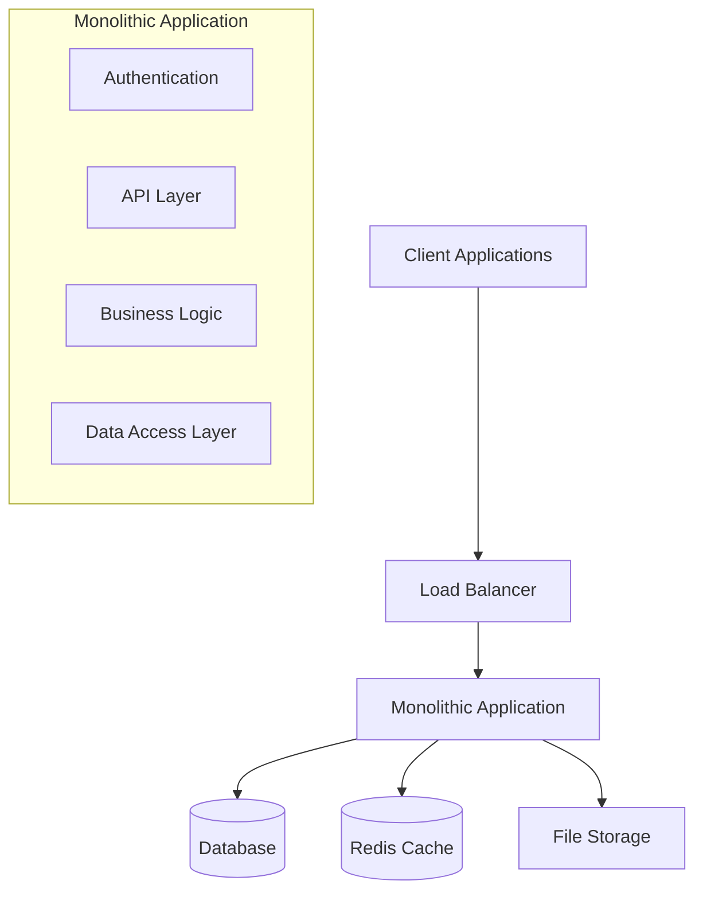
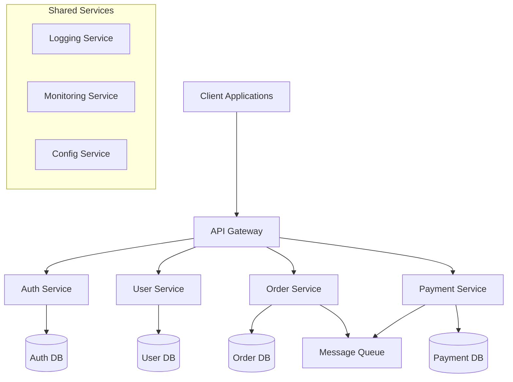
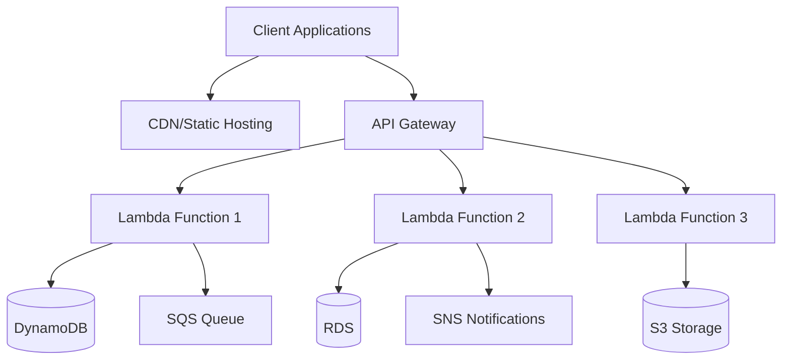
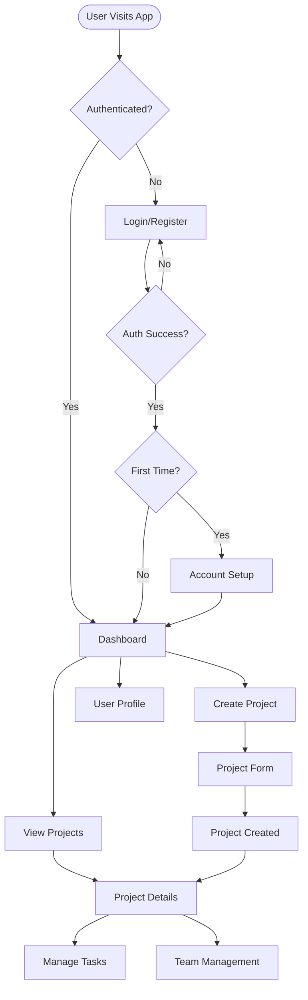

# Phase 3: Design and Architecture

**Duration**: 1-4 weeks (methodology-dependent)  
**Purpose**: Transform project requirements into comprehensive system design, user experience design, technical architecture, and detailed implementation specifications.

## Phase Overview

This phase bridges the gap between project conception and development by creating detailed design specifications, system architecture, user interface designs, and technical blueprints. It establishes the foundation for efficient development by providing clear guidance on system structure, user experience, data flow, and implementation patterns.

## Key Deliverables

### 📋 **Required Outputs**
- [ ] System Architecture Design
- [ ] User Experience (UX) Design and User Flows
- [ ] User Interface (UI) Design System and Mockups
- [ ] Database Schema Design
- [ ] API Design and Documentation
- [ ] Technical Specifications
- [ ] Component Architecture and Design Patterns
- [ ] Integration Architecture and Data Flow

### 📊 **Decision Points**
- System architecture pattern selection (monolithic, microservices, serverless)
- UI/UX design approach and design system framework
- Database design and data modeling decisions
- API design patterns and integration strategies
- Component architecture and reusability patterns
- Performance and scalability design considerations

## Methodology-Specific Guidance

### MVP/Rapid Approach (3-5 days)
**Focus**: Essential design for rapid development with core functionality focus

**Activities**:
- [ ] Basic system architecture diagram
- [ ] Core user flow design
- [ ] Simple UI wireframes and basic design system
- [ ] Essential database schema design
- [ ] Core API endpoint design
- [ ] Basic component structure planning

**Deliverables**:
- System architecture overview
- Core user flows and wireframes
- Basic UI design system
- Essential database schema
- Core API specification
- Component structure diagram

**Success Criteria**:
- Clear development path for core features
- Basic user experience defined
- Essential data structure established
- Core API contracts defined

### Balanced/Standard Approach (1-2 weeks)
**Focus**: Comprehensive design with scalability and user experience considerations

**Activities**:
- [ ] Detailed system architecture with scalability planning
- [ ] Complete user experience design and user journey mapping
- [ ] Comprehensive UI design system and high-fidelity mockups
- [ ] Complete database design with optimization considerations
- [ ] Full API design with documentation and testing strategies
- [ ] Component architecture with reusability patterns

**Deliverables**:
- Detailed system architecture documentation
- Complete UX design with user journey maps
- Comprehensive UI design system and mockups
- Optimized database schema with relationships
- Complete API documentation and specifications
- Component library architecture

**Success Criteria**:
- Scalable system architecture designed
- User experience thoroughly planned and validated
- Complete design system ready for implementation
- Optimized database design with performance considerations

### Comprehensive/Enterprise Approach (2-4 weeks)
**Focus**: Enterprise-grade design with extensive planning, compliance, and integration

**Activities**:
- [ ] Enterprise system architecture with microservices and integration planning
- [ ] Comprehensive UX research and design with accessibility compliance
- [ ] Enterprise UI design system with brand guidelines and accessibility
- [ ] Advanced database design with performance, security, and compliance
- [ ] Enterprise API design with versioning, security, and governance
- [ ] Advanced component architecture with enterprise patterns
- [ ] Integration architecture and enterprise system connectivity

**Deliverables**:
- Enterprise system architecture with integration blueprints
- Research-backed UX design with accessibility compliance
- Enterprise design system with brand guidelines
- Advanced database design with security and compliance
- Enterprise API governance and documentation
- Advanced component architecture with enterprise patterns
- Integration architecture documentation

**Success Criteria**:
- Enterprise-grade architecture supporting complex requirements
- UX design validated through research and accessibility compliance
- Design system meeting enterprise brand and accessibility standards
- Database design meeting enterprise security and compliance requirements

## System Architecture Design

### Architecture Pattern Selection

#### Monolithic Architecture


**Use Cases**: MVP/Rapid development, small to medium applications, simple deployment requirements

**Advantages**:
- Simple development and deployment
- Easy testing and debugging
- Strong consistency
- Lower operational complexity

**Considerations**:
- Scaling limitations
- Technology lock-in
- Potential for tight coupling

#### Microservices Architecture


**Use Cases**: Large applications, multiple teams, complex business domains, high scalability requirements

**Advantages**:
- Independent scaling and deployment
- Technology diversity
- Team autonomy
- Fault isolation

**Considerations**:
- Increased complexity
- Network latency
- Data consistency challenges
- Operational overhead

#### Serverless Architecture


**Use Cases**: Event-driven applications, variable workloads, rapid prototyping, cost optimization

**Advantages**:
- Automatic scaling
- Pay-per-use pricing
- No server management
- Built-in high availability

**Considerations**:
- Cold start latency
- Vendor lock-in
- Limited execution time
- Debugging complexity

### Technology Stack Integration

#### Frontend Architecture
```javascript
// Component Architecture Example
src/
├── components/
│   ├── common/          // Shared components
│   │   ├── Button/
│   │   ├── Input/
│   │   └── Modal/
│   ├── layout/          // Layout components
│   │   ├── Header/
│   │   ├── Sidebar/
│   │   └── Footer/
│   └── features/        // Feature-specific components
│       ├── auth/
│       ├── dashboard/
│       └── profile/
├── hooks/               // Custom React hooks
├── services/            // API and external services
├── store/               // State management
├── utils/               // Utility functions
├── types/               // TypeScript definitions
└── styles/              // Design system and styles
```

#### Backend Architecture
```javascript
// Backend Service Architecture
src/
├── controllers/         // Request handlers
├── services/           // Business logic
├── models/             // Data models
├── middleware/         // Express middleware
├── routes/             // API routes
├── config/             // Configuration
├── utils/              // Utility functions
├── validators/         // Input validation
├── tests/              // Test files
└── database/           // Database related
    ├── migrations/
    ├── seeds/
    └── models/

## User Experience (UX) Design

### User Journey Mapping

#### User Persona Development
```markdown
# Primary User Persona: Sarah, Product Manager

## Demographics
- Age: 32
- Role: Senior Product Manager
- Experience: 8 years in product management
- Tech Savviness: High

## Goals
- Efficiently manage product roadmaps
- Collaborate with development teams
- Track project progress and metrics
- Make data-driven decisions

## Pain Points
- Scattered information across multiple tools
- Difficulty tracking project dependencies
- Limited visibility into development progress
- Time-consuming status reporting

## User Journey
1. **Discovery**: Searches for project management solution
2. **Evaluation**: Compares features and pricing
3. **Trial**: Tests core functionality
4. **Onboarding**: Sets up account and first project
5. **Daily Use**: Manages projects and collaborates
6. **Growth**: Expands usage to team/organization
```

#### User Flow Design


### Accessibility and Usability Design

#### Accessibility Requirements (WCAG 2.1 AA)
- [ ] Color contrast ratio minimum 4.5:1 for normal text
- [ ] Color contrast ratio minimum 3:1 for large text
- [ ] Keyboard navigation support for all interactive elements
- [ ] Screen reader compatibility with proper ARIA labels
- [ ] Alternative text for all images and icons
- [ ] Focus indicators visible and clear
- [ ] Text resizable up to 200% without horizontal scrolling
- [ ] Consistent navigation and layout patterns

#### Usability Principles
```markdown
# Usability Design Principles

## 1. Clarity and Simplicity
- Clear, concise language and labels
- Minimal cognitive load
- Intuitive navigation patterns
- Progressive disclosure of information

## 2. Consistency
- Consistent UI patterns and interactions
- Standardized terminology
- Uniform visual design language
- Predictable behavior across features

## 3. Feedback and Communication
- Clear system status indicators
- Immediate feedback for user actions
- Helpful error messages with solutions
- Progress indicators for long operations

## 4. Error Prevention and Recovery
- Input validation with clear guidance
- Confirmation for destructive actions
- Easy undo/redo functionality
- Graceful error handling and recovery
```

## User Interface (UI) Design System

### Design Token System

#### Color Palette
```css
/* Primary Colors */
:root {
  --color-primary-50: #eff6ff;
  --color-primary-100: #dbeafe;
  --color-primary-200: #bfdbfe;
  --color-primary-300: #93c5fd;
  --color-primary-400: #60a5fa;
  --color-primary-500: #3b82f6;
  --color-primary-600: #2563eb;
  --color-primary-700: #1d4ed8;
  --color-primary-800: #1e40af;
  --color-primary-900: #1e3a8a;
}

/* Semantic Colors */
:root {
  --color-success: #10b981;
  --color-warning: #f59e0b;
  --color-error: #ef4444;
  --color-info: #3b82f6;
}

/* Neutral Colors */
:root {
  --color-gray-50: #f9fafb;
  --color-gray-100: #f3f4f6;
  --color-gray-200: #e5e7eb;
  --color-gray-300: #d1d5db;
  --color-gray-400: #9ca3af;
  --color-gray-500: #6b7280;
  --color-gray-600: #4b5563;
  --color-gray-700: #374151;
  --color-gray-800: #1f2937;
  --color-gray-900: #111827;
}
```

#### Typography System
```css
/* Typography Scale */
:root {
  --font-family-sans: 'Inter', -apple-system, BlinkMacSystemFont, sans-serif;
  --font-family-mono: 'JetBrains Mono', 'Fira Code', monospace;

  /* Font Sizes */
  --text-xs: 0.75rem;    /* 12px */
  --text-sm: 0.875rem;   /* 14px */
  --text-base: 1rem;     /* 16px */
  --text-lg: 1.125rem;   /* 18px */
  --text-xl: 1.25rem;    /* 20px */
  --text-2xl: 1.5rem;    /* 24px */
  --text-3xl: 1.875rem;  /* 30px */
  --text-4xl: 2.25rem;   /* 36px */

  /* Font Weights */
  --font-weight-normal: 400;
  --font-weight-medium: 500;
  --font-weight-semibold: 600;
  --font-weight-bold: 700;

  /* Line Heights */
  --line-height-tight: 1.25;
  --line-height-normal: 1.5;
  --line-height-relaxed: 1.75;
}
```

#### Spacing System
```css
/* Spacing Scale */
:root {
  --space-1: 0.25rem;   /* 4px */
  --space-2: 0.5rem;    /* 8px */
  --space-3: 0.75rem;   /* 12px */
  --space-4: 1rem;      /* 16px */
  --space-5: 1.25rem;   /* 20px */
  --space-6: 1.5rem;    /* 24px */
  --space-8: 2rem;      /* 32px */
  --space-10: 2.5rem;   /* 40px */
  --space-12: 3rem;     /* 48px */
  --space-16: 4rem;     /* 64px */
  --space-20: 5rem;     /* 80px */
  --space-24: 6rem;     /* 96px */
}

### Component Design Specifications

#### Button Component System
```css
/* Button Base Styles */
.button {
  display: inline-flex;
  align-items: center;
  justify-content: center;
  border-radius: var(--border-radius-md);
  font-weight: var(--font-weight-medium);
  transition: all 0.2s ease-in-out;
  cursor: pointer;
  border: none;
  text-decoration: none;
}

/* Button Sizes */
.button--sm {
  padding: var(--space-2) var(--space-3);
  font-size: var(--text-sm);
  min-height: 2rem;
}

.button--md {
  padding: var(--space-3) var(--space-4);
  font-size: var(--text-base);
  min-height: 2.5rem;
}

.button--lg {
  padding: var(--space-4) var(--space-6);
  font-size: var(--text-lg);
  min-height: 3rem;
}

/* Button Variants */
.button--primary {
  background-color: var(--color-primary-600);
  color: white;
}

.button--primary:hover {
  background-color: var(--color-primary-700);
}

.button--secondary {
  background-color: var(--color-gray-200);
  color: var(--color-gray-900);
}

.button--secondary:hover {
  background-color: var(--color-gray-300);
}
```

## Database Schema Design

### Entity Relationship Design

#### Core Entities
```sql
-- Users Table
CREATE TABLE users (
    id UUID PRIMARY KEY DEFAULT gen_random_uuid(),
    email VARCHAR(255) UNIQUE NOT NULL,
    password_hash VARCHAR(255) NOT NULL,
    first_name VARCHAR(100) NOT NULL,
    last_name VARCHAR(100) NOT NULL,
    role VARCHAR(50) DEFAULT 'user',
    email_verified BOOLEAN DEFAULT FALSE,
    created_at TIMESTAMP WITH TIME ZONE DEFAULT NOW(),
    updated_at TIMESTAMP WITH TIME ZONE DEFAULT NOW()
);

-- Projects Table
CREATE TABLE projects (
    id UUID PRIMARY KEY DEFAULT gen_random_uuid(),
    name VARCHAR(255) NOT NULL,
    description TEXT,
    owner_id UUID NOT NULL REFERENCES users(id) ON DELETE CASCADE,
    status VARCHAR(50) DEFAULT 'active',
    start_date DATE,
    end_date DATE,
    created_at TIMESTAMP WITH TIME ZONE DEFAULT NOW(),
    updated_at TIMESTAMP WITH TIME ZONE DEFAULT NOW()
);

-- Tasks Table
CREATE TABLE tasks (
    id UUID PRIMARY KEY DEFAULT gen_random_uuid(),
    title VARCHAR(255) NOT NULL,
    description TEXT,
    project_id UUID NOT NULL REFERENCES projects(id) ON DELETE CASCADE,
    assignee_id UUID REFERENCES users(id) ON DELETE SET NULL,
    status VARCHAR(50) DEFAULT 'todo',
    priority VARCHAR(20) DEFAULT 'medium',
    due_date TIMESTAMP WITH TIME ZONE,
    created_at TIMESTAMP WITH TIME ZONE DEFAULT NOW(),
    updated_at TIMESTAMP WITH TIME ZONE DEFAULT NOW()
);

-- Project Members Table (Many-to-Many)
CREATE TABLE project_members (
    id UUID PRIMARY KEY DEFAULT gen_random_uuid(),
    project_id UUID NOT NULL REFERENCES projects(id) ON DELETE CASCADE,
    user_id UUID NOT NULL REFERENCES users(id) ON DELETE CASCADE,
    role VARCHAR(50) DEFAULT 'member',
    joined_at TIMESTAMP WITH TIME ZONE DEFAULT NOW(),
    UNIQUE(project_id, user_id)
);
```

#### Database Indexes and Optimization
```sql
-- Performance Indexes
CREATE INDEX idx_users_email ON users(email);
CREATE INDEX idx_projects_owner_id ON projects(owner_id);
CREATE INDEX idx_projects_status ON projects(status);
CREATE INDEX idx_tasks_project_id ON tasks(project_id);
CREATE INDEX idx_tasks_assignee_id ON tasks(assignee_id);
CREATE INDEX idx_tasks_status ON tasks(status);
CREATE INDEX idx_tasks_due_date ON tasks(due_date);
CREATE INDEX idx_project_members_project_id ON project_members(project_id);
CREATE INDEX idx_project_members_user_id ON project_members(user_id);

-- Composite Indexes
CREATE INDEX idx_tasks_project_status ON tasks(project_id, status);
CREATE INDEX idx_tasks_assignee_status ON tasks(assignee_id, status);
```

### Data Migration Strategy

#### Migration Framework
```javascript
// Database Migration Example
exports.up = function(knex) {
  return knex.schema.createTable('users', function(table) {
    table.uuid('id').primary().defaultTo(knex.raw('gen_random_uuid()'));
    table.string('email', 255).unique().notNullable();
    table.string('password_hash', 255).notNullable();
    table.string('first_name', 100).notNullable();
    table.string('last_name', 100).notNullable();
    table.string('role', 50).defaultTo('user');
    table.boolean('email_verified').defaultTo(false);
    table.timestamps(true, true);

    // Indexes
    table.index('email');
  });
};

exports.down = function(knex) {
  return knex.schema.dropTable('users');
};
```

## API Design and Documentation

### RESTful API Design

#### API Endpoint Structure
```yaml
# OpenAPI 3.0 Specification
openapi: 3.0.0
info:
  title: Project Management API
  version: 1.0.0
  description: API for project and task management

paths:
  /api/v1/users:
    get:
      summary: Get users
      parameters:
        - name: page
          in: query
          schema:
            type: integer
            default: 1
        - name: limit
          in: query
          schema:
            type: integer
            default: 20
      responses:
        '200':
          description: List of users
          content:
            application/json:
              schema:
                type: object
                properties:
                  data:
                    type: array
                    items:
                      $ref: '#/components/schemas/User'
                  pagination:
                    $ref: '#/components/schemas/Pagination'

    post:
      summary: Create user
      requestBody:
        required: true
        content:
          application/json:
            schema:
              $ref: '#/components/schemas/CreateUserRequest'
      responses:
        '201':
          description: User created
          content:
            application/json:
              schema:
                $ref: '#/components/schemas/User'

components:
  schemas:
    User:
      type: object
      properties:
        id:
          type: string
          format: uuid
        email:
          type: string
          format: email
        firstName:
          type: string
        lastName:
          type: string
        role:
          type: string
          enum: [admin, user, viewer]
        createdAt:
          type: string
          format: date-time

#### API Response Standards
```javascript
// Success Response Format
{
  "success": true,
  "data": {
    // Response data
  },
  "meta": {
    "timestamp": "2024-01-15T10:30:00Z",
    "version": "1.0.0"
  }
}

// Error Response Format
{
  "success": false,
  "error": {
    "code": "VALIDATION_ERROR",
    "message": "Invalid input data",
    "details": [
      {
        "field": "email",
        "message": "Email is required"
      }
    ]
  },
  "meta": {
    "timestamp": "2024-01-15T10:30:00Z",
    "version": "1.0.0"
  }
}

// Pagination Response Format
{
  "success": true,
  "data": [...],
  "pagination": {
    "page": 1,
    "limit": 20,
    "total": 150,
    "totalPages": 8,
    "hasNext": true,
    "hasPrev": false
  }
}
```

## Integration Points

### Core Features Connection
This phase establishes design foundations for all core features:
- **Authentication**: User flow design, security UX patterns, login/registration interfaces
- **Database**: Schema design, data relationships, performance optimization planning
- **API**: Endpoint design, data contracts, integration patterns
- **State Management**: Data flow design, state architecture, component communication
- **Error Handling**: Error UX design, user feedback patterns, recovery flows
- **Testing**: Design validation strategies, component testing approaches

### Technology Stack Integration
Implements design decisions based on technology choices:
- Framework-specific design patterns and component architectures
- Database design optimized for selected database technology
- API design following framework conventions and best practices
- UI design system compatible with selected frontend framework

### Troubleshooting Integration
Design and architecture issue resolution strategies:
- **Design Decisions**: Use `docs/development/troubleshooting/methodology-decisions/` for design choice documentation
- **Architecture Issues**: Document architectural decisions and trade-offs
- **UX Problems**: Create user experience testing and validation blockers
- **Performance Concerns**: Document performance design decisions and optimizations

### Knowledge Management
Capture design and architecture learnings:
- Design system patterns and component libraries
- Architecture patterns and best practices
- User experience research and validation methods
- Database design patterns and optimization techniques

## Phase Completion Criteria

### Quality Gates
- [ ] System architecture designed and validated for scalability and performance
- [ ] User experience design completed with accessibility compliance
- [ ] UI design system comprehensive and ready for implementation
- [ ] Database schema optimized and validated for performance
- [ ] API design complete with comprehensive documentation

### Design Validation
- [ ] Architecture reviewed and approved by technical stakeholders
- [ ] UX design validated through user testing or stakeholder review
- [ ] UI design system tested for accessibility and usability
- [ ] Database design reviewed for performance and scalability
- [ ] API design validated for completeness and consistency

### Stakeholder Approval
- [ ] Technical architecture approved by development team
- [ ] UX design approved by product stakeholders
- [ ] UI design approved by design stakeholders
- [ ] Database design approved by data stakeholders
- [ ] API design approved by integration stakeholders

### Documentation Complete
- [ ] Architecture documentation complete with diagrams and specifications
- [ ] Design system documentation complete with usage guidelines
- [ ] Database schema documentation complete with relationships and constraints
- [ ] API documentation complete with examples and testing guidelines
- [ ] Handoff to core development phase prepared

## Next Phase Preparation

### Core Development Setup
- [ ] Design system components ready for implementation
- [ ] Database schema ready for migration and setup
- [ ] API specifications ready for implementation
- [ ] Component architecture ready for development
- [ ] Integration patterns documented and ready

### Development Readiness Assessment
Based on design and architecture outcomes:
- **MVP/Rapid**: Essential design complete, ready for rapid development
- **Balanced/Standard**: Comprehensive design ready for structured development
- **Comprehensive/Enterprise**: Enterprise-grade design ready for complex implementation

## Related Documentation

- [Technology Stack Selection](../01-technology-stack-selection/README.md)
- [Project Setup](../02-project-setup/README.md)
- [Core Development](../04-core-development/README.md)
- [Quality Assurance](../05-quality-assurance/README.md)
- [Core Features Overview](../../core-features/README.md)
- [CSS Modules Guide](../../development/CSS_MODULES_GUIDE.md)
- [Troubleshooting System](../../development/troubleshooting/README.md)
- [Knowledge Management](../../knowledge/README.md)

## Enhanced Documentation Integration

### 🔧 Feature Development Integration
- [Feature Development Best Practices](../feature-development/README.md) - Feature architecture planning and component design guidance
- [Feature Planning Template](../feature-development/feature-planning-template.md) - Design considerations for feature planning

### 🛠️ Git Workflow Integration
- [Git Workflow and Policies](../git-workflow/README.md) - Git workflow finalization and branching strategy implementation
- [Branching Strategies](../git-workflow/branching-strategies.md) - Design phase branching considerations

---

*Phase 3 of 8 | Next: Core Development*
*Methodology Support: MVP/Rapid, Balanced/Standard, Comprehensive/Enterprise*
*Integration: Core Features, Feature Development, Git Workflow, Technology Stack, Troubleshooting System, Knowledge Management*
