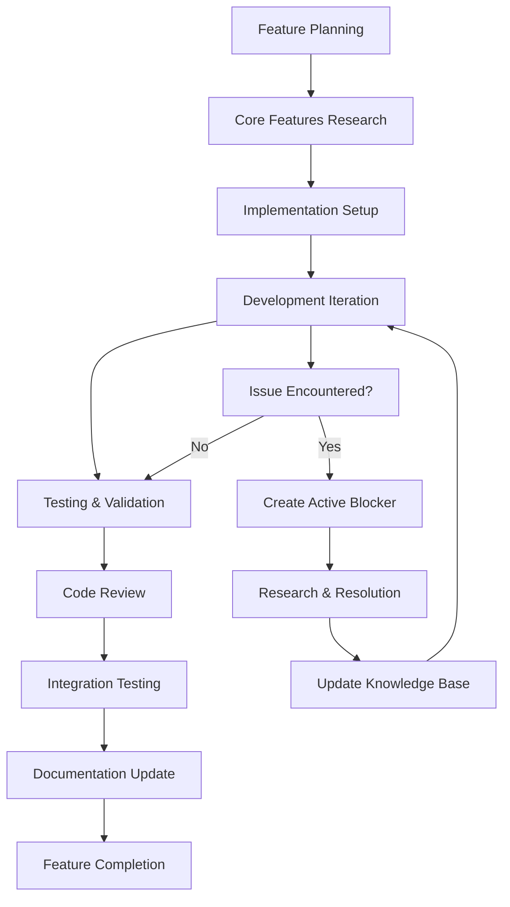

# Feature Development Best Practices

**Purpose**: Comprehensive guidelines for individual feature development cycles within Phase 4 (Core Development)  
**Integration**: Seamlessly connects with existing Phase 4 documentation and core features system  
**Methodology Support**: MVP/Rapid, Balanced/Standard, Comprehensive/Enterprise

## Overview

This documentation provides detailed best practices for developing individual features within the Core Development phase. It bridges the gap between high-level phase planning and day-to-day development work, ensuring consistent quality and integration across all features.

## Feature Development Lifecycle

### 1. Feature Planning and Scoping

#### Pre-Development Checklist
- [ ] Feature requirements clearly defined
- [ ] Integration points with core features identified
- [ ] Methodology-specific scope determined
- [ ] Dependencies and prerequisites verified
- [ ] Success criteria established
- [ ] Testing strategy outlined

#### Scoping Guidelines by Methodology

**MVP/Rapid (2-4 weeks per feature)**
- Focus on essential functionality only
- Minimal customization and configuration
- Basic error handling and validation
- Essential unit tests only
- Simple integration patterns

**Balanced/Standard (4-8 weeks per feature)**
- Complete feature functionality
- Moderate customization options
- Comprehensive error handling
- Full testing coverage (unit + integration)
- Standard integration patterns

**Comprehensive/Enterprise (8-12 weeks per feature)**
- Full feature with enterprise enhancements
- Extensive customization and configuration
- Advanced error handling and monitoring
- Complete testing suite (unit + integration + E2E)
- Advanced integration patterns and optimizations

### 2. Development Workflow

#### Standard Feature Development Process



#### Daily Development Workflow

**Morning Setup (15 minutes)**
1. Review feature progress and current task
2. Check for any blocking issues or dependencies
3. Review relevant core features documentation
4. Plan development tasks for the day

**Development Iteration (2-4 hours)**
1. Implement feature components following best practices
2. Write tests as you develop (TDD approach recommended)
3. Document any issues in active blockers
4. Commit frequently with meaningful messages

**End-of-Day Review (15 minutes)**
1. Review code changes and test coverage
2. Update feature progress tracking
3. Document any lessons learned
4. Plan next day's tasks

### 3. Core Features Integration

#### Authentication Integration
**Reference**: [Authentication Documentation](../../core-features/authentication/README.md)

**Integration Checklist**:
- [ ] User authentication requirements identified
- [ ] Permission and role requirements defined
- [ ] Authentication patterns implemented per best practices
- [ ] Security considerations addressed
- [ ] Testing includes authentication scenarios

**Common Patterns**:
- Route protection and access control
- User context and session management
- API authentication and authorization
- Error handling for auth failures

#### Database Integration
**Reference**: [Database Documentation](../../core-features/database/README.md)

**Integration Checklist**:
- [ ] Data model requirements defined
- [ ] Database schema changes planned
- [ ] Migration scripts created
- [ ] Query optimization considered
- [ ] Data validation implemented

**Common Patterns**:
- Entity relationship modeling
- Query optimization and indexing
- Transaction management
- Data validation and constraints

#### API Integration
**Reference**: [API Documentation](../../core-features/api/README.md)

**Integration Checklist**:
- [ ] API endpoints designed and documented
- [ ] Request/response schemas defined
- [ ] Error handling implemented
- [ ] Rate limiting considered
- [ ] API testing completed

**Common Patterns**:
- RESTful endpoint design
- Request validation and sanitization
- Response formatting and status codes
- Error response standardization

#### State Management Integration
**Reference**: [State Management Documentation](../../core-features/state-management/README.md)

**Integration Checklist**:
- [ ] State requirements identified
- [ ] State management patterns selected
- [ ] Data flow designed
- [ ] Caching strategy implemented
- [ ] State testing completed

**Common Patterns**:
- Client-side state management
- Server state synchronization
- Optimistic updates
- Cache invalidation strategies

### 4. Quality Gates and Standards

#### Code Quality Standards

**Code Organization**
- Follow established project structure
- Use consistent naming conventions
- Implement proper separation of concerns
- Maintain clean and readable code

**Performance Standards**
- Optimize for target performance metrics
- Implement efficient algorithms and data structures
- Consider memory usage and resource consumption
- Profile and benchmark critical paths

**Security Standards**
- Follow security best practices
- Implement input validation and sanitization
- Use secure authentication and authorization
- Protect against common vulnerabilities

#### Testing Standards

**Unit Testing Requirements**
- Minimum 80% code coverage (MVP), 90% (Balanced), 95% (Comprehensive)
- Test all public methods and functions
- Include edge cases and error scenarios
- Use meaningful test descriptions

**Integration Testing Requirements**
- Test feature interactions with core systems
- Validate API endpoints and data flow
- Test authentication and authorization
- Verify error handling and recovery

**End-to-End Testing Requirements** (Balanced/Comprehensive)
- Test complete user workflows
- Validate UI interactions and behavior
- Test cross-browser compatibility
- Verify performance under load

### 5. Code Optimization and Cleanup

#### Pre-Commit Optimization Checklist

**Code Review**
- [ ] Remove commented-out code
- [ ] Eliminate unused imports and variables
- [ ] Optimize imports and dependencies
- [ ] Ensure consistent formatting

**Performance Review**
- [ ] Identify and optimize performance bottlenecks
- [ ] Implement efficient data structures
- [ ] Optimize database queries
- [ ] Minimize bundle size impact

**Security Review**
- [ ] Remove sensitive data from code
- [ ] Validate all user inputs
- [ ] Implement proper error handling
- [ ] Check for security vulnerabilities

**Documentation Review**
- [ ] Update inline code comments
- [ ] Update API documentation
- [ ] Update feature documentation
- [ ] Update troubleshooting guides

#### Refactoring Guidelines

**When to Refactor**
- Code duplication exceeds 3 instances
- Function complexity exceeds methodology limits
- Performance metrics fall below targets
- Code becomes difficult to test or maintain

**Refactoring Process**
1. Ensure comprehensive test coverage
2. Identify refactoring scope and goals
3. Implement changes incrementally
4. Run tests after each change
5. Update documentation as needed

## Templates and Checklists

### Feature Planning Template

```markdown
# Feature: [Feature Name]

## Overview
- **Description**: [Brief feature description]
- **Methodology**: [MVP/Balanced/Comprehensive]
- **Estimated Duration**: [Time estimate]
- **Priority**: [High/Medium/Low]

## Requirements
- **Functional Requirements**:
  - [ ] Requirement 1
  - [ ] Requirement 2

- **Non-Functional Requirements**:
  - [ ] Performance targets
  - [ ] Security requirements
  - [ ] Accessibility requirements

## Core Features Integration
- **Authentication**: [Required/Not Required]
- **Database**: [Changes needed/No changes]
- **API**: [New endpoints/Modifications]
- **State Management**: [State requirements]
- **Error Handling**: [Error scenarios]
- **Testing**: [Testing strategy]

## Success Criteria
- [ ] Criterion 1
- [ ] Criterion 2
- [ ] Criterion 3

## Dependencies
- [ ] Dependency 1
- [ ] Dependency 2

## Risks and Mitigation
- **Risk 1**: [Description] - [Mitigation strategy]
- **Risk 2**: [Description] - [Mitigation strategy]
```

### Feature Completion Checklist

```markdown
# Feature Completion Checklist: [Feature Name]

## Implementation
- [ ] Core functionality implemented
- [ ] Integration with authentication system
- [ ] Database changes implemented and tested
- [ ] API endpoints created and documented
- [ ] State management implemented
- [ ] Error handling implemented
- [ ] UI/UX components completed

## Testing
- [ ] Unit tests written and passing
- [ ] Integration tests completed
- [ ] End-to-end tests completed (if required)
- [ ] Performance testing completed
- [ ] Security testing completed
- [ ] Accessibility testing completed

## Code Quality
- [ ] Code review completed
- [ ] Performance optimization completed
- [ ] Security review completed
- [ ] Documentation updated
- [ ] Refactoring completed (if needed)

## Integration
- [ ] Feature integrated with existing systems
- [ ] No breaking changes introduced
- [ ] Backward compatibility maintained
- [ ] Migration scripts created (if needed)

## Documentation
- [ ] Feature documentation updated
- [ ] API documentation updated
- [ ] Troubleshooting guide updated
- [ ] User documentation updated (if needed)

## Deployment Readiness
- [ ] Feature flags configured (if needed)
- [ ] Environment variables configured
- [ ] Database migrations ready
- [ ] Monitoring and logging configured
```

## Integration with Existing Systems

### Phase 4 Integration
This documentation directly supports and enhances the existing Phase 4 (Core Development) documentation by providing:
- Detailed feature-level guidance
- Practical implementation workflows
- Quality assurance integration
- Troubleshooting system connectivity

### Core Features Integration
Seamlessly integrates with existing core features documentation:
- References and builds upon established patterns
- Provides feature-specific implementation guidance
- Maintains consistency with best practices
- Enhances troubleshooting capabilities

### Troubleshooting System Integration
Connects with the existing troubleshooting system:
- Uses established active blocker workflows
- Contributes to resolved issues knowledge base
- Enhances prevention strategies
- Maintains methodology-specific guidance

## Related Documentation

- [Phase 4: Core Development](../04-core-development/README.md)
- [Core Application Features](../../core-features/README.md)
- [Development Troubleshooting](../../development/troubleshooting/README.md)
- [Git Workflow and Policies](../git-workflow/README.md)

---

*Feature Development Best Practices | Supports Phase 4 Core Development*
*Methodology Support: MVP/Rapid, Balanced/Standard, Comprehensive/Enterprise*
*Integration: Core Features, Troubleshooting System, Quality Assurance*
